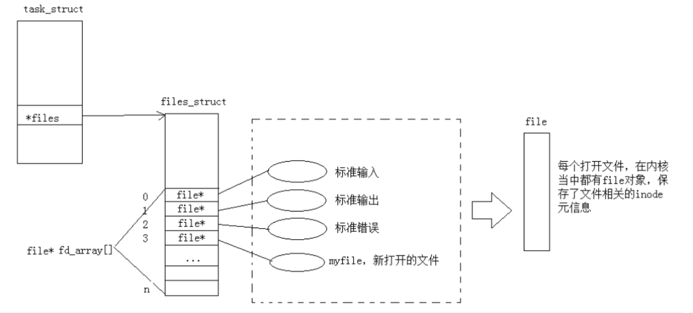
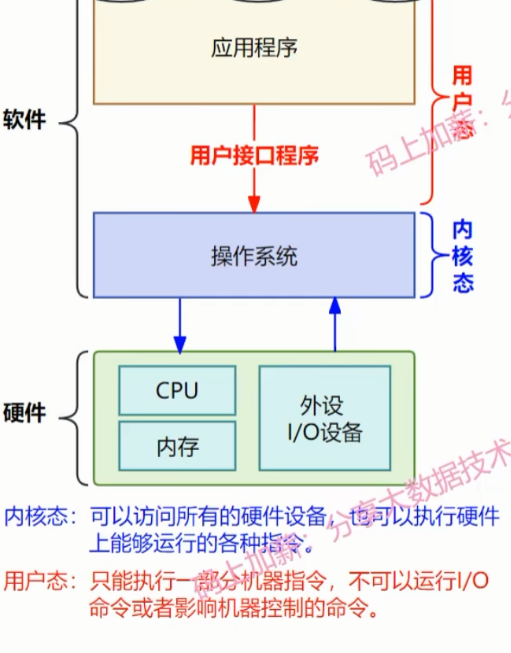
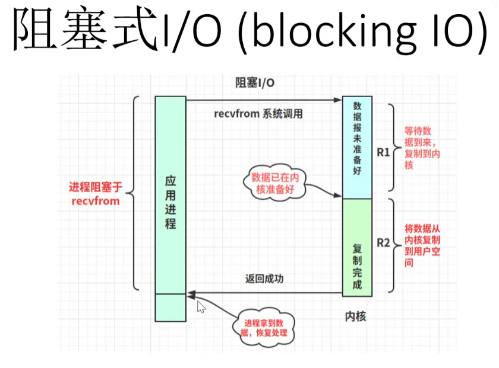
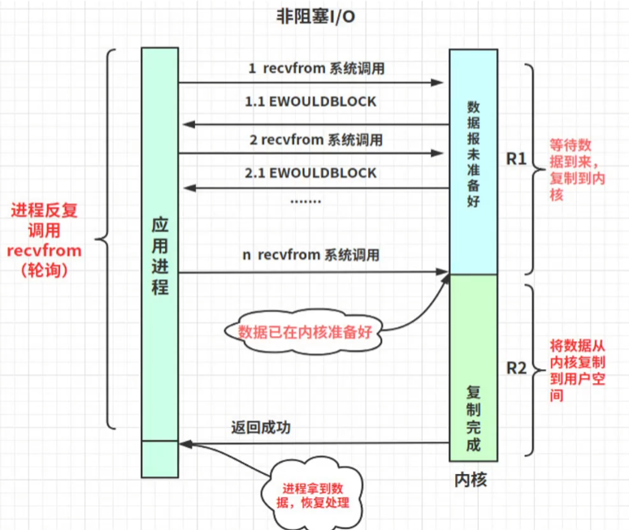
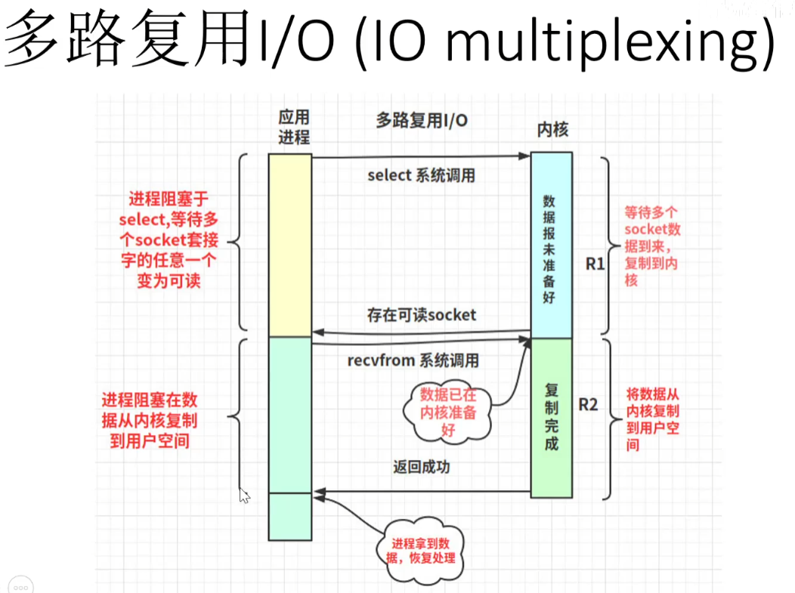
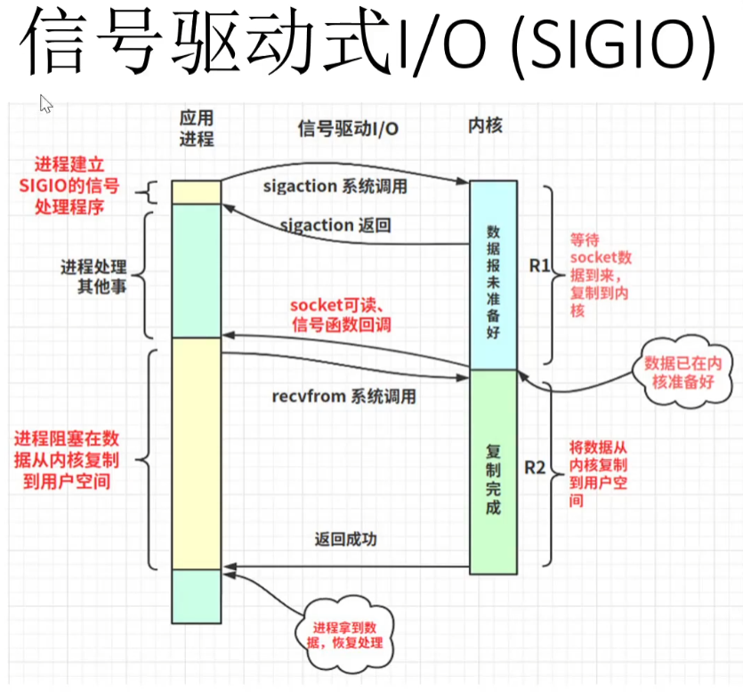
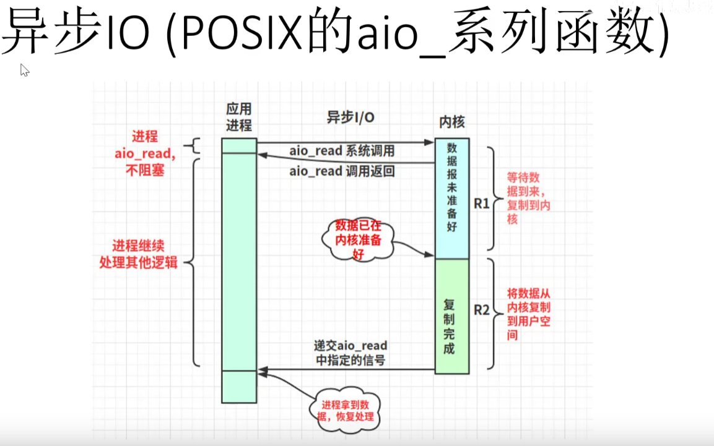

## linux下的rsync（文件同步）用法

```Shell
[root@localhost ~]rsync /etc/fstab /tmp                # 在本地同步
[root@localhost ~]rsync -r /etc 172.16.10.5:/tmp       # 将本地/etc目录拷贝到远程主机的/tmp下，以保证远程/tmp目录和本地/etc保持同步
[root@localhost ~]rsync -r 172.16.10.5:/etc /tmp       # 将远程主机的/etc目录拷贝到本地/tmp下，以保证本地/tmp目录和远程/etc保持同步
[root@localhost ~]rsync /etc/                          # 列出本地/etc/目录下的文件列表
[root@localhost ~]rsync 172.16.10.5:/tmp/              # 列出远程主机上/tmp/目录下的文件列表
```

**源路径如果是一个目录的话，带上尾随斜线和不带尾随斜线是不一样的，不带尾随斜线表示的是整个目录包括目录本身，带上尾随斜线表示的是目录中的文件，不包括目录本身。**

## linux下怎么创建、复制、移动、删除文件和目录

```bash
# 创建目录
mkdir mydir
# 创建文件
touch myfile.txt
# 复制文件到目录
cp myfile.txt mydir/
# 复制目录
cp -r mydir mydir_copy
# 移动文件并重命名
mv myfile.txt newfile.txt
# 移动目录并重命名
mv mydir mydir_new
# 删除文件
rm newfile.txt
# 删除目录
rm -r mydir_new
# 强制删除目录及其内容
rm -rf mydir_copy
```

<a name="pipline"></a>

## Linux 管道

管道的本质就是内核在内存中开辟了一个缓冲区，这个缓冲区与管道文件相关联，对管道文件的操作，被内核转换成对这块缓冲区的操作。

**匿名管道:**

* 使用竖线 | 连接多个命令，这被称为管道符 : `$ command1 | command2`
* 管道也是文件。在使用管道符 "|" 时， "|" 左边的进程以写的方式打开管道文件，将标准输出重定向到管道之中， "|" 右边的进程以读的方式打开管道文件，将标准输入重定向到管道之中。
* 通过管道符 | 创建的管道是匿名管道，用完了就会被**自动销毁**。并且，匿名管道只能在具有**亲缘关系**（父子进程）的进程间使用。
* **局限性：** **「管道中的数据只能单向流动」**，也就是**半双工通信**，如果想实现相互通信（全双工通信），我们需要创建两个管道才行，一个方向一个。

**命名管道：**

使用 Linux 命令 mkfifo 来创建有名管道： `$ mkfifo mypipe`

* 有名管道，也称做**FIFO**，因为数据是先进先出的传输方式。
* 所谓有名管道也就是提供一个路径名与之关联，这样，即使与创建有名管道的进程不存在亲缘关系的进程，只要可以访问该路径，就能够通过这个有名管道进行相互通信。

## linux管道和重定向的区别

**管道 (|):**
用于将一个命令(**进程**)的输出直接传递给另一个命令（进程）作为输入。它允许你将多个命令组合在一起，以便在一个命令链中处理数据。基于**内核**各进程间**共享**。

```bash
ls | grep ".txt"
# 这个命令会列出当前目录中所有包含“.txt”扩展名的文件。ls 的输出被传递给 grep 来过滤结果。
```

**重定向 (> 和 <)：**
用于将命令的输入或输出流重定向到**文件**或设备，而不是默认的标准输入（键盘）/输出（屏幕）。
GDB中debug时常使用 < 来将文件中的数据作为该程序的输入

```bash
ls -l /tmp > dir.txt # 将ls命令生成的/tmp目录的一个清单存到当前目录中的dir.txt文件中(覆盖)
ls -l /tmp >> dir.txt # 追加
```

**具体实现为改变默认的文件描述符：**
**输入重定向:**
先**关掉默认文件描述符0（代表标准输入）**，之后open后会返回一个文件描述符，根据文件描述符的规则：找到当前没有被使用的最小的一个下标，所以fd就是0；然后再读取数据就会读取该文件。

```C
// log.txt
112 333

// .c
int main()
{
    close(0); // 关掉标准输入
    int fd = open("log.txt", O_RDONLY);// fd = 0
    int a = 0, b = 0;
    scanf("%d %d",&a, &b);

    printf("a = %d, b = %d\n", a, b); // a = 112, b = 5678
    return 0;
}
```

**输出重定向：**
同理，此时需**关掉默认描述符1（代表标准输出）**

```C
int main()
{
    close(1);
    int fd = open("log.txt", O_CREAT | O_WRONLY | O_TRUNC, 0666); // fd = 1
    printf("aaaaaaaaaaaa\n");
    printf("aaaaaaaaaaaa\n");
    printf("aaaaaaaaaaaa\n");
    // log.txt
    // aaaaaaaaaaaa
    // aaaaaaaaaaaa
    // aaaaaaaaaaaa
    return 0;
}
```

**追加重定向:**
同样是**关掉标准输出1**，但此时**open的参数为O_APPEND表示追加**

```C
int main()
{
    close(1);
    int fd = open("log.txt", O_CREAT | O_WRONLY | O_APPEND, 0666); // 此时打开文件的模式为O_APPEND
    printf("aaaaaaaaaaaa\n");
    printf("aaaaaaaaaaaa\n");

    return 0;
}
```


## 文件描述符

**Linux中所有内容都是以文件的形式保存和管理的**。**普通文件**是文件，**目录**（Windows下称为文件夹）是文件，**硬件设备**（键盘、监视器、硬盘、打印机）是文件，所以说**linux下一切皆文件**。

在Linux中，**文件描述符是内核为了高效的管理已经被打开的文件所创建的索引** ，它是一个**非负整数**，用于**指代被打开的文件**，**所有执行I/O操作的系统调用都是通过文件描述符完成的**。

在Linux中，**进程是通过文件描述符 (file descriptors 简称fd)来访问文件的**。 **在程序刚启动的时候，默认有三个文件描述符，分别是：0 (代表标准输入)，1 (代表标准输出)，2 (代表标准错误)。**

可以通过**open函数**得到一个指定文件的文件描述符，如果出现错误则返回-1。open函数需要传入一个文件路径和操作模式，调用会返回一个整型的文件描述符。

```c
int main()
{   
    // O_RDONLY: 只读模式
    // O_WRONLY: 只写模式
    // O_RDWR : 读写模式
    // O_NONBLOCK: 非阻塞模式
    // O_APPEND: 追加模式
    // O_CREAT: 创建并打开一个新文件
    // O_TRUNC: 打开一个文件并截断它的长度为零（必须有写权限）
    // O_EXCL: 如果指定的文件存在，返回错误
    int fd1 = open("log.txt", O_CREAT | O_WRONLY | O_TRUNC, 0666);
    int fd2 = open("log.txt", O_CREAT | O_WRONLY | O_TRUNC, 0666);
    int fd3 = open("log.txt", O_CREAT | O_WRONLY | O_TRUNC, 0666);
    int fd4 = open("log.txt", O_CREAT | O_WRONLY | O_TRUNC, 0666);
    int fd5 = open("log.txt", O_CREAT | O_WRONLY | O_TRUNC, 0666);
    printf("fd1: %d\n", fd1); // fd1: 3
    printf("fd2: %d\n", fd2); // fd2: 4
    printf("fd3: %d\n", fd3); // fd3: 5
    printf("fd4: %d\n", fd4); // fd4: 6
    printf("fd5: %d\n", fd5); // fd5: 7
    close(fd1);
    close(fd2);
    close(fd3);
    close(fd4);
    close(fd5);

    return 0;
}
```

**当一个程序运行起来加载到内存后，创建对应的数据结构，就会变成一个进程。其中关键是进程控制块`PCB`**。在**Linux内核中，`PCB`为`task_struct`**,**`task_struct`中有一个指向文件结构体的指针`files_struct`* fs**。重点是在**文件结构体中有一个指针数组`file* fd_arry[]`（文件映射表）**，**其中的指针指向的就是我们对应的文件**。通过fd我们可以查找到内存中的文件, 我们所新**打开的文件fd的值**是文件描述表中**最小的为空的位置的索引**。

 


## 内核空间和用户空间

内核(kernel)空间，它独立于普通的应用程序，可以访问受保护的内存空间，也有访问底层硬件设备的所有权限。
为了保证内核的安全，现在的操作系统一般都强制用户进程不能直接操作内核。具体的实现方式基本都是由**操作系统将虚拟地址空间划分为两部分，一部分为内核空间，另一部分为用户空间**。针对 **Linux 操作系统**而言，**最高的 1G 字节由内核使用，称为内核空间**。而**较低的 3G 字节由各个进程使用，称为用户空间**。
最高 1G 的**内核空间**是被**所有进程共享**的！

  

## Linux下的五种网络IO模型

Linux的五种IO模型，分别是：**阻塞IO、非阻塞IO、多路复用IO、信号驱动IO以及异步IO。**
其中**前四者都属于同步IO。**

$IO: \text{input or output 访问外设}$

***当我们read/recv时, 如果底层缓冲区没有数据, read/recv函数会阻塞
当我们read/recv时, 如果底层缓冲区有数据, read/recv函数会拷贝***

IO = **等待(阻塞) + 拷贝**, 高效IO: 让等待的比重降低

### 一、阻塞 I/O 模型

  

最基础的I/O模型就是阻塞I/O模型，也是最简单的模型。
所有的操作都是顺序执行的。
阻塞I/O模型中，用户空间的应用程序执行一个**系统调用**(recvfrom)，会导致应用程序被阻塞:

1. **内核等待数据报就绪(R1)**
2. **将数据报从内核拷贝到用户空间(R2)**
3. **全部完成后再唤醒应用进程处理数据。**
在R1、R2连续两个阶段，整个进程都被阻塞。

缺点:**每次 I/O 请求都会阻塞进程/线程**，所以需要为**每个请求分配一个进程/线程**以确保及时响应，**系统资源占用开销大。**

### 二、非阻塞 I/O 模型

  

进程**轮询发送系统调用（recvfrom）**:

1. **R1不阻塞**，如果**内核发现数据报尚未到达，则会返回错误码（`EWOULDBLOCK`）**, 系统进程可继续连续发送系统调用（recvfrom）或暂停去做其他事。
2. **R2仍阻塞**，当数据报准备就绪后，进程需等待内核将其拷贝到用户空间。

缺点：**轮询会消耗大量资源。**

### 三、 多路复用I/O模型

  

I/O 复用模型的思路就是**将多个进程的 I/O 注册到一个复用器**（select、poll 或 epoll）上，**这样就可以通过该复用器监视多个文件描述符, 一旦某个描述符就绪，就通知程序进行相应的读写操作**

**三种多路复用的实现方式：**

1. `select`
    select 基于**轮询**的方式进行对文件描述符进行监听，其仅仅知道了有I/O事件发生了，却并不知道是哪几个流（可能有一个，多个，甚至全部），我们只能无差别轮询所有流，找出能读出数据，或者写入数据的流，对他们进行操作。所以select**具有$O(n)$的无差别轮询复杂度**, 同时 select 的**监听数量也有限制(底层数据结构，位图（bitmap）)**

2. `poll`
   **poll本质上和select没有区别**，也是**基于轮询**的方式进行对文件描述符进行监听，**时间复杂度$O(n)$**, 只不过修改了文件描述符集合的结构(**基于链表**来存储的)，**没有了监听数量的限制。**

3. `epoll`
    epoll可以理解为event poll, **底层数据结构为红黑树**，不同无差别轮询，**epoll会把哪个流发生了怎样的I/O事件通知我们, 此时时间复杂度降低到了O(1)**

### 四、信号驱动 I/O 模型

  

当进程发起一个 I/O 操作:

1. **R1阶段不阻塞**，而是**通过系统调用** sigaction() 或 siganal()**向内核注册一个信号处理函数**，然后进程返回不阻塞。
2. **当内核发现数据报准备好后，拷贝到内核并向进程发送SIGIO信号通知进程**，此时**进程再向内核发送系统调用（recvfrom）**
3. **R2阶段仍阻塞，等待数据从内核复制到用户空间。**

缺点：**一般用于UDP中**，对TCP套接口几乎是没用的，原因是**TCP诸如大量ACK信息使得信号产生得过于频繁**


### 五、异步 I/O 模型

前面四种IO模型实际上都属于**同步IO**，因为无论是那个模型，IO操作的**第2个阶段(R2)都会引起阻塞，也就是需等待内核将数据拷贝到用户空间。**


  

异步IO:

1. **用户进程发起异步读（`aio_read`）系统调用**，**内核收到进程发送的异步读（`aio_read`）系统调用后会直接返回，表明read请求已经成功发起了**; **无论内核缓冲区数据是否准备好，都不会阻塞当前进程;**
2. **内核把整个 I/O 处理完后再通知该进程，此时进程可直接使用用户空间内的所需数据**
**R1、R2**两阶段时进程**都是非阻塞的**。

缺点：真正的异步 I/O 需要操作系统做大量的工作。目前 Windows 下通过 IOCP 实现了真正的异步 I/O，Linux 系统在 Linux2.6 才引入 AIO 且并不完善，因此在 Linux 下实现高并发网络编程时仍然是以 I/O 复用模型为主。