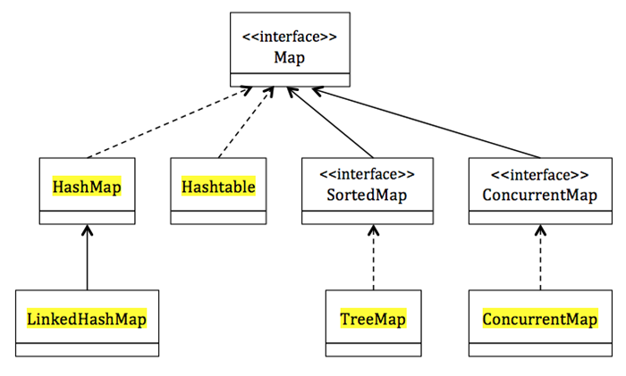
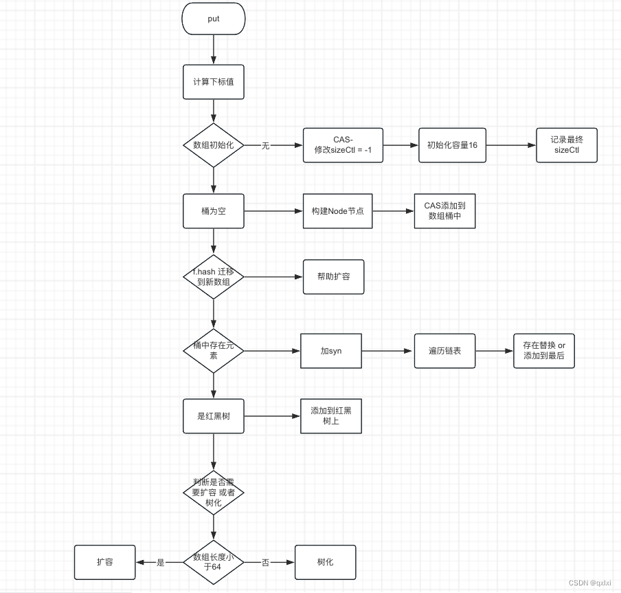
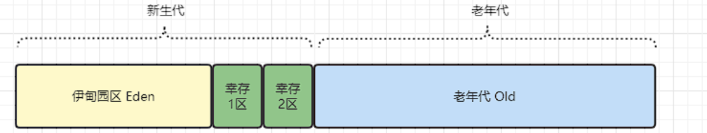
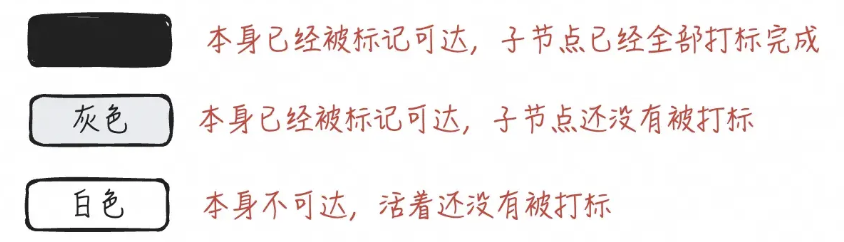
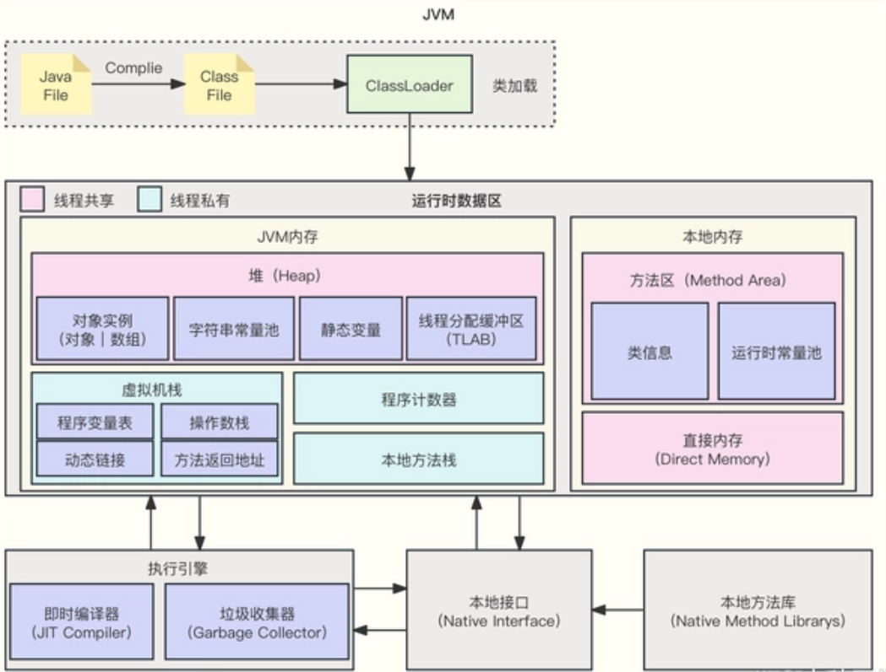
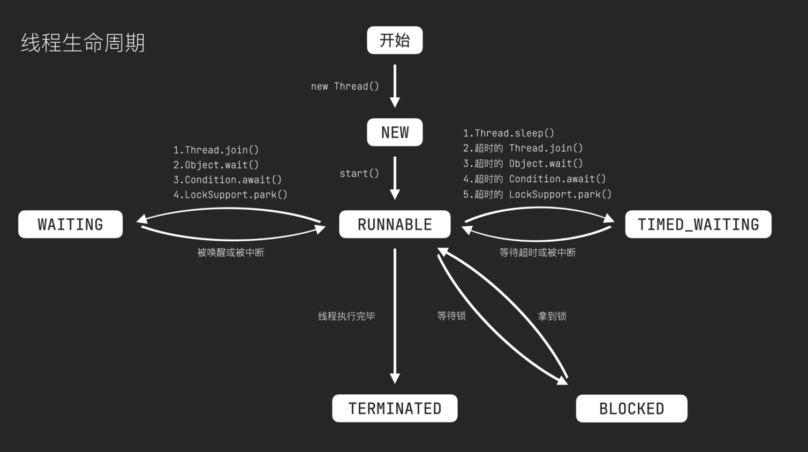
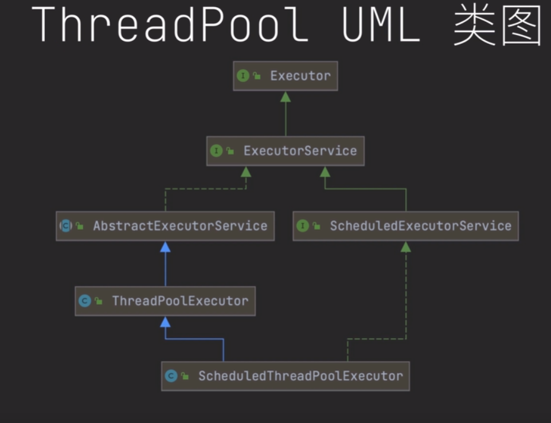
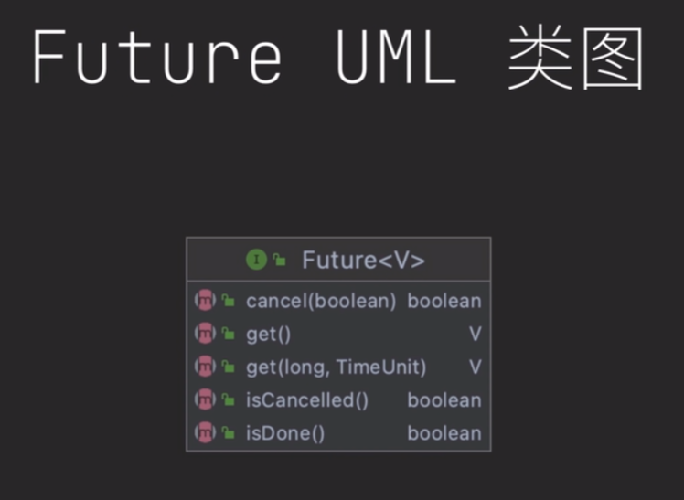
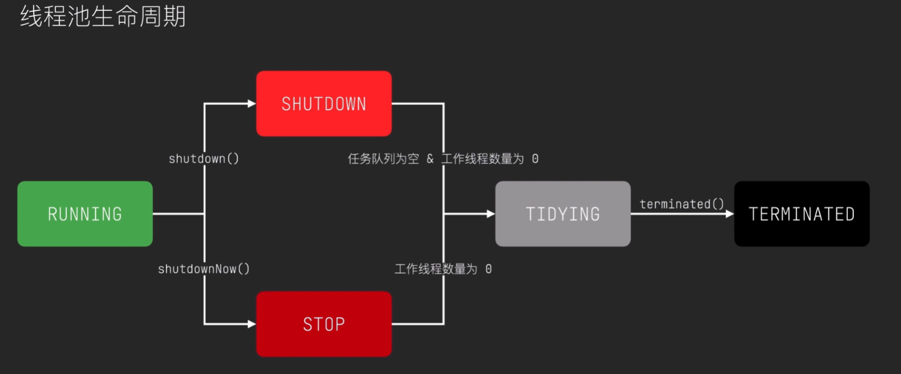
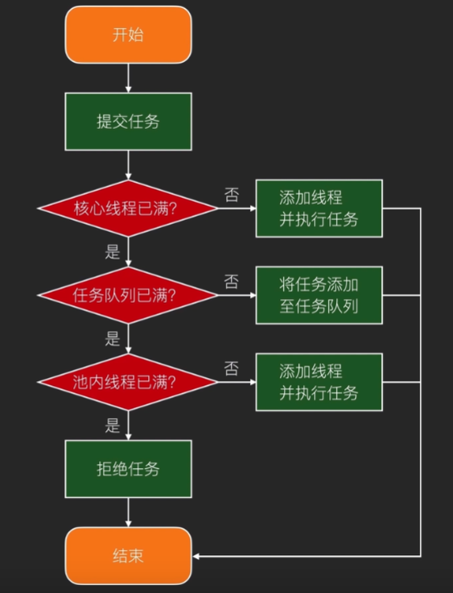

## ArrayList 和 LinkedList 区别:

* `ArrayList` 是通过数组实现的，当数组空间不足时需要进行扩容操作，插入和删除元素时需进行元素的移动，效率较低；支持随机访问，时间复杂度为 $O(1)$。
* `LinkedList` 是基于双向链表实现的, 插入和删除元素时只需要改变相邻节点的指针, 不支持随机访问，需要从头或尾节点开始遍历，时间复杂度为 $O(n)$。

## HashMap 原理，底层

* `HashMap`是一种基于哈希表的数据结构，用于存储**键值对**, 底层实现是**数组（bucket）+链表/红黑树**, 非synchronized线程不安全;
* 当创建一个 HashMap 实例时，它会初始化一个默认大小的数组（默认为16），每个数组元素是一个链表;
* 在 Java 8 中，如果链表的长度超过了 8 ，那么链表将转化为红黑树；链表长度低于6，就把红黑树转回链表;
* put() 和 get() 方法通过计算键 key 的 hashCode() 值，然后根据该值计算该键值对应在数组中的位置（求余）;
* **扩容** 当 HashMap 中存储的键值对数量超过数组大小的一定值时（默认75%），就会触发扩容操作。具体来说，HashMap 会将数组大小翻倍，并重新计算每个键值对在新数组中的位置并重新放置。
* 作为key对象,必须实现hashCode和equals,并且key的内容不能修改；当两个元素的hashCode的值相等,通过equals判断是否为相同的元素
* 允许key/value为空
* 在JDK1.7中采用的是头插法, 在JDK1.8中采用的是尾插法。多线程情况下头插法会出现链表成环的问题
* 在扩充HashMap的时候，不需要重新计算hash，只需要看看原来的hash值新增的那个bit是1还是0就好了，是0的话索引没变，是1的话索引变成原位置+原数组长度。

## 其余 Java::Map 接口

  

### LinkedHashMap: HashMap子类:

* 相较于 HashMap 后者多维护着一个存储所有条目的双向链表。此链接列表定义了迭代顺序，该迭代顺序通常就是将键插入到映射中的顺序（插入顺序）。
* 重要成员变量与重要内部方法：
  * 1. `accessOrder`：
        默认为 false（即默认按照插入顺序迭代, 使用 put() 方法时，新加入元素加入双向链表末尾
        为 true 时（按照访问顺序迭代，支持实现 LRU 算法时, 使用 get() 方法时会把 get 到的元素放入双向链表尾部
  * 2. `removeEldestEntry(Map.Entry)`:
        默认返回 false
        可以重写该方法来制定添加元素时的策略。方法内部返回 true 时，当要往该map中存放（put\putAll）元素时，就先删除最老的对象，然后再添加新对象。

### Hashtable类:

* 无序，底层数组+链表，线程安全（采用synchronized修饰）, 所有方法都加同步锁，在多线程运行环境下效率表现非常低下。当一个线程访问HashTable的同步方法时，其他线程也访问同步方法就会进入阻塞状态，**废弃，不推荐使用**，现版本在多线程的情况下使用线程安全类时多被ConcurrentHashMap取代

### SortedMap的实现类：TreeMap:

* 有序，底层红黑树，线程不安全，构造函数中提供了参数`Comparator`，可以自定义实现排序

### ConcurrentMap的实现类：ConcurrentHashMap:

* 线程安全, 加锁的高效性
* JDK1.7版本的CurrentHashMap的实现原理: 数组+Segment(分段锁), 将数据分成一段一段的存储(默认16片)，然后给每一段数据配一把锁，当一个线程占用锁访问其中一个段数据的时候，其他段的数据也能被其他线程访问，能够实现真正的并发访问。
* JDK1.8版本的CurrentHashMap的实现原理: 数组+链表/红黑树，采用Synchronized + CAS(实现原子操作) + volatile(保证可见性)。

`CurrentHashMap::put(key,value)`法中调用了putVal方法：

```java
public V put(K key, V value) {
        return putVal(key, value, false);
}
```



分为两部分内容，

（1）、第一部分：首先开启了无限循环，在里面进行了4中情况的判断。

* 第一种情况：如果table数组需要被创建。
如果table数组为null或者长度为0，则创建table数组。

* 第二种情况：如果寻址后的位置没有被占用。
创建Node节点，cas插入到这个位置

* 第三种情况：如果寻址后的位置是正在迁移状态。
加入到迁移大军中，帮助一起进行扩容迁移操作。

* 第四种情况：其他情况
将节点插入到链表中或者红黑树中。

（2）、 第二部分：执行addCount，将ConcurrentHashMap中存储的k,v总数+1。

```java
/**putVal整体框架 **/
final V putVal(K key, V value, boolean onlyIfAbsent) {
        // 开启无限循环
        for (Node<K,V>[] tab = table;;) {
            Node<K,V> f; int n, i, fh;
            // case 1: table数组为null或长度为0，初始化table
            if (tab == null || (n = tab.length) == 0)
                // 调用initTable()初始化
                tab = initTable();
            // case 2: 寻址目标节点所在的table索引位置的头节点，若为空, 直接cas添加新节点
            /**
            * 通过hash值对应的数组下标得到第一个节点；虽然table数组是volatile线程间可见，但是数组元素未必。
            *所以，调用tabAt()以volatile读的方式来读取table数组中的元素，保证每次拿到的数组都是最新的
            */
            else if ((f = tabAt(tab, i = (n - 1) & hash)) == null) {
                //调用casTabAt()通过cas将新的值封装成node插入即可；
                //如果cas失败，说明存在竞争，则进入下一次循环
                if (casTabAt(tab, i, null,
                             new Node<K,V>(hash, key, value, null)))
                    break;                   // no lock when adding to empty bin
            }
            // case 3: 如果寻址后位置的头节点hash==MOVED==1,表示正在迁移状态, 则帮助一起进行扩容迁移操作
            else if ((fh = f.hash) == MOVED)
                // 多线程并发扩容, 各线程CAS transferIndex 来分配各自负责迁移的节点。
                tab = helpTransfer(tab, f);
            // case 4: 将节点插入到链表中或者红黑树中
            else {
                V oldVal = null;
                // 对该下标下的头节点f加SYN锁，极大的避免了由于加锁导致的效率低下的问题
                synchronized (f) {
 				        // ... 针对f链表或红黑树进行添加Node节点操作，执行完毕后break ...  
 				        }  
                if (binCount != 0) {
                  // 进行table数组扩容或链表树化操作
                    if (binCount >= TREEIFY_THRESHOLD)
                        treeifyBin(tab, i);
                    if (oldVal != null)
                        return oldVal;
                    break;
                }
            }
        }
        addCount(1L, binCount);
        return null;
    }
```

## 可重入锁

可重入指持有锁的线程可以多次重复加锁

```java
boolean tryLock() {
    Thread current = Thread.currentThread(); // 获得当前线程
    // 状态为0表示可获得锁
    int c = getState(); // 获得当前所得状态
    if (c == 0) {
      // 通过CAS进行锁争抢，只有一个线程能成功加锁
        if (compareAndSetState(0, 1)) {
          // 记录当前持有锁的线程
            setExclusiveOwnerThread(current);
            return true;
        }
    } 
    // 锁重入：持有锁的线程 == 当前线程
    else if (getExclusiveOwnerThread() == current) {
        // 状态自增
        if (++c < 0) // overflow
            throw new Error("Maximum lock count exceeded");
        setState(c);
        return true;
    }
    return false;
}


boolean tryRelease(int releases) {
  // 这里releases == 1
  // 状态自减1
    int c = getState() - releases;

    // 如果请求释放锁的不是持有锁的线程
    if (getExclusiveOwnerThread() != Thread.currentThread())
        throw new IllegalMonitorStateException();
    // 减到状态为0，说明锁释放了
    boolean free = (c == 0);
    if (free)
        setExclusiveOwnerThread(null);
    setState(c);
// 如果返回true，会唤醒阻塞队列的线程
    return free;
}
```


## 悲观锁和乐观锁

### 悲观锁（Pessimistic Locking）：

* 对资源持有较悲观态度的锁定方式。它假设数据在并发访问时极有可能发生冲突，因此每次访问数据前都会先加锁，共享资源每次只给一个线程使用。
* Java中，`synchronized`从偏向锁、轻量级锁到重量级锁，**全是悲观锁**。JDK提供的Lock实现类**全是悲观锁**。
* 常见的实现方式是传统的关系型数据库中的行级锁、表级锁、读锁、写锁等等。
* 适用于高并发、数据竞争激烈的场景，如金融交易、库存管理等。这类场景下，冲突发生的可能性很高，所以加锁确保数据的一致性。 
* 缺点：
  * 1.**性能不高**，因为每次请求都会先对数据进行加锁， 然后进行数据操作，最后再解锁，而加锁释放锁的过程会造成消耗
  * 2.**系统吞吐量降低**，因为锁定机制会阻止其他线程并发访问资源。
  * 3.**容易产生死锁（Deadlock）**，如果锁的持有和释放管理不当，会导致系统无法继续运行。
 
### 乐观锁（Optimistic Locking）:

* 对资源持相对乐观的态度，假设并发操作冲突的可能性较小，因此不会主动加BB而是进行数据版本检查来决定是否提交操作。
* 常见的实现方式有**版本号机制**和**CAS算法**实现。
* CAS请求参数：V(内存地址)，A(旧的预期值)，B(要修改的更新值)。当且仅当旧的预期值A和内存地址V处的值相同时，将内存值V修改为B，否则什么都不做或重来。
* 适用于多读的应用，如阅读类应用、CMS系统等。
* 发生冲突时线程回滚重试
* 缺点：
  1. 在并发冲突频繁的场景下，可能会导致大量重试操作，影响性能.
  2. 需要显式管理版本控制机制.


## Java虚拟机(JVM)垃圾回收(GC)机制和常见垃圾收集器

### GC Roots：

* 必定存活的对象
* 对象的引用是一组树状结构（不是网状，有环就内存泄漏了），沿着GC Roots节点全盘梳理，那么没有被引用到的对象，就已经可以被回收掉了，这种方法被称为可达性分析

### STW（stop the world）：

* 为了垃圾回收，需要暂停我们的业务代码
* 如果尽可能降低STW的时间----“并发”。因此，各种垃圾回收算法开始从垃圾回收流程上进行优化拆解，引入各种可以的“并发”过程，控制STW的时间。

### 垃圾回收算法：

* `标记-复制算法`：将内存分隔为两块相同大小的区域，每次只使用其中的一块，每当GC完成后，将存活的对象复制到另一块区域，然后将前一块清空。
* `标记-清除算法`：分为标记和清除两个阶段，标记存活的对象，然后GC清除掉没有被标记的对象。
* `标记-整理算法`：大体流程和标记清除法一致，但是它具有整理内存空间的功能。这种算法避免了内存碎片化的问题，但是效率上相对于标记-清除法略低。


### 分代收集理论:

* JVM的大部分虚拟机将堆空间逻辑划分为新生代/年轻代、老年代，垃圾收集器可以根据不同的区域选择不同的回收算法进行GC。
 

### 三色标记算法

三色标记算法是一种常用的根可达性分析算法，它主要用于标记可达对象和不可达对象。在三色标记算法中，垃圾回收器将对象分为三种颜色：黑色、灰色和白色。

  

算法的大致流程（初始状态所有对象都是白色）：

* 从根对象开始，将所有可达的对象标记灰色，根对象标记为黑色
* 遍历所有灰色对象，将它们引用的对象标记为灰色，自己标记为黑色
* 最后垃圾回收所有白色标记对象。

并发标记（不STW）带来的漏标和错标：

* 本应该是垃圾的对象被视为了非垃圾（浮动垃圾）：已经被标记为黑色或灰色的对象被断开而变为不可达的垃圾，影响不大，下次GC会收集
* 本应该不是垃圾的对象被视为了垃圾: 尚未被算法分析到的白色对象成为黑色对象的引用，由于黑色对象已经分析过了，该白色对象将无法再被标记为灰色。**影响很大**。

解决方法：

* `读写屏障`：在读写操作前后插入一段代码，用于记录一些信息、保存某些数据等
* `增量更新`（Incremental Update）, CMS用于解决漏标的处理方式:
  * 当黑色对象新增一个白色对象的引用时，就通过写屏障将这个引用关系记录下来。
  * 在重新标记阶段，将这些引用关系中的黑色对象变为灰色，再扫描一次，以此保证不会错误被GC当成垃圾对象被回收
  * 重新标记需要STW，防止在重新标记阶段如果用户线程还是继续执行造成无限循环
* `原始快照`（SATB，Snapshot At The Beginning）, G1垃圾收集器解决漏标的办法:
  * 在灰色对象断开对白色对象的引用时，通过写屏障中记录被置空的白色对象
  * 在重新标记阶段，将这些引白色对象变为灰色，再扫描一次
  * 优点：效率会更高，重新标记阶段的层次更低（增量更新变换的灰色对象是原始快照的父级）
  * 缺点：若记录的对象实际无被任何引用但标记为灰色，则会带来更多浮动垃圾
  * G1选择原始快照的原因：G1收集多代的垃圾，对象跨代引用扫描代价更大，若采用增量更新STW时间会较长。

### CMS收集器（Concurrent Mark Sweep）：

* 老年代收集器，基于标记清除算法，JDK8默认, 适用于要求低延迟的应用场景
* `阶段一：初始标记`: 将GC Roots作为根节点扫码与之直连的对象，速度较快耗时很短，但是会暂停用户线程STW。
* `阶段二：并发标记`: 从上一阶段GC Roots直连的对象作为开始，通过可达性分析算法扫码整个堆，标记出所有可达的对象，这个过程很长，但是可以和用户线程并发执行，所以没有STW。但是并发标记阶段会存在多标、漏标的问题。
* `阶段三：重新标记`：修正并发标记阶段因为用户线程在执行可能导致对象的引用链发生变化而产生的错误标记，该过程需STW。
* `阶段四：并发清理`：清除所有不可达的对象。
* `阶段五：并发重置`：阶段重置本次GC过程中标记的数据。

### G1垃圾收集器（Garbage First）：

* 分代标记, 宏观上表现为标记-整理算法，但微观Region是复制算法；将堆空间分为多个区域（Eden, Surviver, Old），分别进行垃圾收集，并根据区域中的对象分布情况来进行垃圾收集， JDK11 默认。
* G1的回收分类: 在一般情况下，只需要针对新生代做`YoungGC`, 当内存使用率过高时，再触发`MixedGC`对所有分区进行整体回收。
* 适用于大内存、多核CPU的场景。
* `阶段一：初始标记`：同CMS, 从GC roots开始做可达性分析（在young GC时，由于不回收老年代，还需加上老年代的对象）， STW短暂
* `阶段二：并发标记`: 同CMS；
* `阶段三：最终标记`：同CMS处理多标和漏标，但是漏标的问题和CMS处理手段不一样，**CMS使用的是增量更新**，**G1使用的是原始快照**。
* `阶段四：筛选回收`：对各个Region区域做回收的成本分析，根据用户设置的期望GC停顿时间来制定回收计划。回收阶段针对Region使用复制算法，将标记了的对象复制到临近的空闲区域，从宏观上来说类似于G1采用了标记-整理法，这种模式相对于CMS而言减少了内存碎片的问题。

### ZGC垃圾收集器（Z Garbage Collector）：

一款基于Region内存布局的，不设分代（不分老年代、新生代）的，使用了读屏障、染色指针和内存多重映射等技术来实现的基于标记-整理算法实现的，以低延迟为首要目标的一款并发的垃圾收集器。

### *Pythoy的内存管理

引用计数： Python 主要采用引用计数的方式来管理内存。每个对象都有一个引用计数器，当引用计数为 0 时，对象就会被销毁。标记-清除： 为了解决循环引用问题，Python 引入了标记-清除算法，周期性地扫描所有对象，标记可达对象，然后回收不可达对象。分代回收： Python 将对象分为不同的代，新创建的对象属于年轻代，存活时间长的对象属于年老代。不同代的回收频率不同，以优化回收效率。

### *Go 采用三色标记法进行垃圾标记清除回收。

###. 产生死锁的必要条件

* `互斥条件`: 进程对资源的访问是排他的
* `占有且等待资源`: 一个进程申请资源得不到满足时处于等待资源的状态，且不释放已占资源
* `不可抢占`：资源不能被抢占，只能由进程持有者显式释放
* `循环等待`: 等待队列成环

## JVM的组成

### JVM是什么

Java虚拟机用于运行Java程序编译出来的字节码，屏蔽了与具体操作系统平台相关的信息，从而实现跨平台的运行.

  

### JVM主要组成部分

* `运行时数据区`(JVM内存， 本地内存)
* `执行引擎`(JC，GC)
* `本地接口`
* `本地方法库`

### JVM内存结构

JVM内存结构指的是JVM运行时数据区结构，它主要包含以下几个部分：

* `堆（Heap）`：**线程共享**，最大内存区域
  * `存储对象实例和数组`: 保存所有 **new** 关键字创建的对象， 分为新生代（伊甸区，幸存区（S1,S2））和老年区，比例为1：1：8， 创建的对象首先进入Eden区，当Eden内存不足时，触发**MinorGC**（又称**YoungGC**）, 将存活对象复制到Survivor区，依次类推，当老年去也内存不足时，触发 **FullGC** 回收整个堆的非存活对象，如果采用G1垃圾回收器则触发**MixedGC**.
  * `字符串常量池`: 用于存储字符串常量。在Java中，字符串常量是不可变的，因此可以被共享。这样可以减少内存的使用，提高程序的性能。
  * `静态变量`: 指在类中定义的变量，它们的值在整个程序运行期间都不会改变。
  * `线程本地分配缓冲区（TLAB）`: 用于提高线程分配对象时的效率。
* `方法区（Method Area）`：**线程共享**
  * `类信息`: 加载到方法区中的Class文件信息
  * `运行时常量池`: 存储程序运行时的静态变量（由字母、数字等构成的字符串或者数字常量）和符号引用
  * `即时编译的代码缓存`
* `虚拟机栈（VM Stack）`：**线程私有**
  * 每个线程运行时创建自己的虚拟机栈，每个栈由多个栈帧（Stack Frame）组成，每个方法被执行时，Java虚拟机都会同步创建一个栈帧用于存储该方法的局部变量表、操作数栈、动态链接、方法返回地址等信息
* `本地方法栈`（Native Method Stack）：线程私有
  * 类似虚拟机栈, 但服务于本地方法的调用。
* `程序计数器（Program Counter Register）`：**线程私有**
  * 可看作是当前线程所执行的字节码的行号指示器。

## JVM、JRE和JDK的关系是什么

  

* `JVM`: **Java Virtual Machine** Java虚拟机
  * JVM 是一个运行在操作系统之上的虚拟机，用于执行javac（Java编译器）将Java代码(.java)转换而来的字节码(.class)
  * JVM 读取字节码并生成机器特定代码。为了生成特定于机器的代码(最后交给本机CPU执行)，JVM 需要是特定于机器的。因此每种类型的机器（Windows / Linux / Mac）都有一个特定的 JVM。
  * JVM 提供了Java的可移植性
* `JRE`: **Java Runtime Environment** Java运行环境 = JVM + 运行应用程序所需的库。
  * 如果您只需要运行已编译的 Java 程序，但不需要开发它们，那么 JRE 就是您所需要的
* `JDK`: **Java Development Kit** Java开发工具包 = JRE + 开发Java应用程序所需的工具和库。
  * 工具包括编译器（javac）、调试器(Java Debugge)、文档生成器(JavaDoc)等


## Java string 特性

* 不能被继承： String类是final修饰的，不能被继承（final修饰的类不能被继承，修饰的方法不能被重写，修饰的变量为常量。）
* 设计成不可变的原因：
  * `字符串常量池的设计`：JVM堆中字符串常量池的存在，多个字符串对象可以共享同一个字符串常量，减少内存占用。
  * `安全性`: 防止被攻击修改
  * `提高缓存利用率和性能`： 能被多个线程安全共享，不需要额外的同步措施
* 实际使用中如果需要进行字符串拼接等操作，可以使用`StringBuilder`或`StringBuffer`类, 其中StringBuffer是线程安全的。


## Array和ArrayList 区别

* `Array` 是一种静态数据结构，长度固定, 在声明时需要指定长度，可以存储基本类型和对象类型，不支持泛型
* `ArrayList` 动态数组，长度可以动态扩容，只能包含对象类型，支持泛型，有许多实用API, 线程不安全，如需安全可使用List接口下的另一个`vector`, 它在每个方法上都使用了synchronized关键字进行同步锁。

## Java的synchronized

synchronized关键字是一个用于同步访问共享资源的机制，它可以确保并发编程中的三个关键要素：原子性、可见性和有序性。

1. **原子性（Atomicity）**
原子性是指一个操作或者多个操作要么全部执行完成，要么全部不执行，不会出现部分执行的情况。在Java中，synchronized通过在同一时间只允许一个线程访问被锁定的代码块或方法来保证原子性。当一个线程进入synchronized代码块或方法时，其他试图访问该资源的线程将被阻塞，直到第一个线程释放锁。

2. **可见性（Visibility）**
可见性是指一个线程对共享变量的修改对其他线程是可见的。在Java中，synchronized通过内存屏障（Memory Barrier）来保证可见性。当一个线程释放synchronized锁时，它会将本地缓存中的变量值刷新到主内存中，当其他线程获取synchronized锁时，它会从主内存中读取最新的变量值，从而保证了可见性。

3. **有序性（Ordering）**
有序性是指程序执行的顺序按照代码的先后顺序执行。在并发编程中，由于编译器优化和处理器乱序执行等因素，程序的实际执行顺序可能与代码的编写顺序不一致。synchronized通过禁止指令重排来保证有序性。当一个线程进入synchronized代码块或方法时，它会看到一个一致的程序执行顺序，即按照代码编写的顺序执行。
需要注意的是，虽然synchronized可以保证原子性、可见性和有序性，但它并不是解决所有并发问题的银弹。过度使用synchronized可能导致性能问题，如锁竞争和死锁。因此，在使用synchronized时，需要仔细考虑并发访问的模式和锁的范围，以确保在保证正确性的同时获得良好的性能。

synchronized可用来给对象和方法或者代码块加锁，当它锁定一个方法或者一个代码块的时候,同一时刻最多只有一个线程执行这段代码。

三种用法：
```Java
// 同步代码块
synchronized (object) { // object获得同步锁，锁类型可以为对象类型/this/类类型

}

// 同步方法
访问修饰符 synchronized 返回值类型 方法名(参数类型 参数名称）{ // 此时this对象获得同步锁，锁类型为this
  //方法体
}

// 静态同步方法
访问修饰符 static synchronized 返回值类型 方法名(参数类型 参数名称) { // 此时同步锁为object.class, 锁类型为类类型
  //方法体
}
```

## 死锁

两个或两个以上的线程争夺彼此的锁，造成阻塞，程序永远处于阻塞状态。

死锁产生的四个条件：

1. 互斥条件（Mutual Exclusion）：至少有一个资源必须处于非共享状态，即一次只能被一个进程或线程占用。

2. 请求与保持条件（Hold and Wait）：进程或线程至少需要持有一个资源，并且在等待其他资源时不释放已占有的资源。

3. 不可剥夺条件（No Preemption）：已分配给进程或线程的资源不能被强制性地剥夺，只能由持有资源的进程或线程主动释放。

4. 循环等待条件（Circular Wait）：存在一个进程或线程的资源申请序列，使得每个进程或线程都在等待下一个进程或线程所持有的资源。

代码例子：

```Java
public class DeadlockExample {
    private static Object lockA = new Object(); 
    private static Object lockB = new Object();
 
    public static void main(String[] args) {
        // 启动线程 1
        Thread thread1 = new Thread(new Runnable() {
            public void run() {
                // 获得lockA的同步锁
                synchronized (lockA) {
                    System.out.println("Thread 1: Holding lock A");
                    try {
                        Thread.sleep(1000);
                    } catch (InterruptedException e) {
                        e.printStackTrace();
                    }
                    System.out.println("Thread 1: Waiting for lock B");
                    // 等待lockB同步锁的释放
                    synchronized (lockB) {
                        System.out.println("Thread 1: Holding locks A and B");
                    }
                }
            }
        });
        thread1.start();
 
        // 启动线程 2
        Thread thread2 = new Thread(new Runnable() {
            public void run() {
                // 获得lockB的同步锁
                synchronized (lockB) {
                    System.out.println("Thread 2: Holding lock B");
                    try {
                        Thread.sleep(1000);
                    } catch (InterruptedException e) {
                        e.printStackTrace();
                    }
                    System.out.println("Thread 2: Waiting for lock A");
                    // 等待lockA同步锁的释放
                    synchronized (lockA) {
                        System.out.println("Thread 2: Holding locks A and B");
                    }
                }
            }
        });
        thread2.start();
    }
}
```

## Java中volatile关键字

* 保证了不同线程之间对共享变量操作的**可见性**。volatile修饰的共享变量在执行写操作后，会立即刷回到**主存**，同时cpu会通知**其他线程**，缓存已被修改，需要**更新缓存**。这样每个线程都能获取到最新的变量值。以供其它线程读取到最新的记录。
* 通过禁止编译器、CPU指令重排序和部分hapens-before规则，解决**有序性**。
* 对单个volatile修饰变量的读/写具有原子性，类似于i++这种复合操作不具有原子性。
* volatile仅保证最低限度的原子操作, 生产中还是推荐synchronized 、或者Lock锁。

## Java的面向对象的四大特性

与C++特性相似

### 一. 封装

我们将类的属性（私有化），同时，提供公共的（public）方法来获取（getxxx）和设置（setxxx）此属性的值

Java规定的四种权限：（从小到大排列）：**private、缺省、protected、public**

| 修饰符     | 类内部 | 同一个package | 不同包的继承子类 | 同一个工程 |
|------------|--------|----------|--------------|------------|
| private    | $\checkmark$    |          |              |            |
| 缺省       | $\checkmark$    | $\checkmark$      |              |            |
| protected  | $\checkmark$    | $\checkmark$      | $\checkmark$          |            |
| public     | $\checkmark$    | $\checkmark$      | $\checkmark$          | $\checkmark$        |

### 二. 继承

继承性的格式：

```java
class A extends B {
  "some code"
}
```

* 一旦子类A继承父类B之后，子类A中获取父类B中生命的**所有**的结构、属性、方法。可显性使用**super**调用，或运行时获取最近的方法。

* 子类继承父类之后，还可以声明**自己特有**的属性和方法，实现功能的扩展

* 如果我们没有显示的声明一个类的父类的话，则此类继承于**Java.lang.Object类**

**重写override:**

子类继承父类之后，可以对父类中**同名同参数**的方法，进行**覆盖**操作, 记得加 **@override**修饰便于查错。

### 三. 多态

允许基类（父类）的引用指向派生类的对象，并调用相应的方法

多态性的使用前提：①要有类的**继承**关系。②要有方法的**重写**。

**编译时**类型由声明该变量时使用的类型决定(**左侧，即父类的引用**)，**运行时**类型由实际赋给该变量的对象决定（**右侧，即子类的对象**）。

### 四. 抽象

抽象性是指当设计一个类时，不让该类面向具体的类，而是面向抽象类或接口，具体的类实现时要实现抽象类中的全部定义方法。

**抽象类：**

在Java中，当用`abstract`关键字来修饰一个类时，这个类被称为抽象类, 抽象类可以有常量也可以有变量，可以有抽象方法也可有非抽象方法。**不能被实例化**

```java
public abstract class Geometry {
	String name;//图形名称
	//计算面积(抽象方法)
	public abstract double getArea();
}
```

非抽象子类用`extends`继承该抽象类并实现

```java
public class Rectangle extends Geometry{
  "..."
}
```

**接口：**

接口是一种特殊的抽象类，类似于C/C++的$.h$文件，但更严格，接口中**只能包含常量和抽象方法的定义**，而没有变量和具体方法的实现。在Java中，接口是通过`interface`关键字来定义, **不能被实例化**。

```java
public interface Geometry {}
```

为了使用接口，需要编写接口的实现类。Java使用`implements`关键字表示类实现接口，一个类可以同时实现多个接口，接口之间用逗号“,”分隔。

```java
public class Circle implements Geometry {}
```

## 常见的设计模式

### 工厂模式

将创造对象和使用对象分离，创造对象的函数->创造工厂

### 建造者模式

用于构造复杂对象（大量参数），引入builder来分步构建对象，必填参数，可选参数
返回自身从而链式调用

### 单例模式

一般用于一个类只需要一个实例的情况
逻辑判断类是否已有实例。

## JDK17新特性

* jdk17是继jdk8和jdk11之后的一个最新长期支持版本
* 增加了switch类型匹配, switch 可直接用 instanceof 模式匹配选择
* 增强的伪随机数生成器
* Java 14 中包含了一个新特性Records,解决了使用类作为数据包装器的一个常见问题。纯数据类从几行代码显著地简化为一行代码。
* 新的垃圾回收器（ZGC）

## i++与++i

* 二者都不是原子操作，因为都是先从主存获取，再递增，再写回
* i++ 先获取i值再递增，类似于getAndIncrease
* ++i 先递增再获取i值，类似于increaseAndGet


## 线程

### wait()和sleep()的区别：

1. sleep是线程中的方法，使当前线程休眠一定时间；wait是Object中的方法，要执行wait方法，线程必须持有锁，调用obj.wait()使当前持有obd对象同步锁的线程进行等待. (把线程放到等待队列中), 并释放该锁，之后被notify唤醒后尝试重新获得锁并继续执行剩余代码。
2. sleep方法不会释放lock，wait会释放，而且会加入到等待队列中。
3. sleep方法不依赖于同步器synchronized，但是wait需要依赖synchronized关键字。
4. sleep不需要被唤醒（休眠之后推出阻塞），但是wait需要（不指定时间需要被别人中断或唤醒）。

### 线程状态和生命周期

线程状态以枚举类存储在Thread类中：

```Java
public enum State {
  NEW,
  RUNNABLE,
  BLOCKED,
  WATTING,
  TIME_WATTING,
  TERMINATED;
}
```

获取线程状态的方法`getState()`:

```Java
/**
 * 返回该线程的状态
 * @return 此线程的状态
 */
public State getState()
```

|状态|描述|触发条件|
|---|---|---|
|NEW|刚创建的线程处于此状态|`new Thread()`|
|RUNNABLE|可/正在执行的线程处于此状态|`Thread.start()`|
|BLOCKED|被阻塞等待锁的线程处于此状态|`synchronized` <br> `Lock.lock()`|
|WATTING|无限期等待的线程处于此状态, 之后要么被唤醒，要么被中断|`Thread.join()` <br> `Object.wait()` <br> `Condition.await()` <br> `LockSupport.park()`|
|TIME_WATTING|限期等待的线程处于此状态|`Thread.sleep()` <br> 超时的`Thread.join()` <br> 超时的`Object.wait()` <br> 超时的`Condition.await()` <br> 超时的`LockSupport.park()`|
|TERMINATED|已退出的线程处于此状态|线程执行结束(正常结束，异常结束)|

  


## 线程池

### 线程池的创建

  

* **【强制】线程资源必须通过线程池提供，不允许在应用中自行显式创建线程。**
**说明：** 线程池的好处是减少在创建和销毁线程上所消耗的时间以及系统资源的开销，解决资源不足的问题。
如果不使用线程池，有可能造成系统创建大量同类线程而导致消耗完内存或者“过度切换”的问题。

* **【强制】线程池不允许使用 `Executors`去创建，而是通过 `ThreadPoolExecutor` 的方式，这样的处理方式让写的同学更加明确线程池的运行规则，规避资源耗尽的风险。**
**说明：** Executors 返回的线程池对象的弊端如下：
1） FixedThreadPool 和 SingleThreadPool：
允许的请求队列长度为 Integer.MAX_VALUE，可能会堆积大量的请求，从而导致 OOM(Out Of Memory)。
2） CachedThreadPool：
允许的创建线程数量为 Integer.MAX_VALUE，可能会创建大量的线程，从而导致 OOM。

**正式开发环境不要使用以下三种线程池创建方法:**
  `FixedThreadPool`, `SingleThreadPool`, `CachedThreadPool`, 三者都属于`Executors`工具类中，内部都采用`ThreadPoolExecutor`来创建线程池，做了简化参数操作，`ThreadPoolExecutor`是创建线程池的原生方式。

1. `FixedThreadPool`(固定大小的线程池):
核心线程数和最大线程数一样, 空闲线程存活时间为0ms即空闲线程不会被销毁，任务队列采用LinkedBlockingQueue,此队列有资源耗尽风险，应为其默认队列长度为Integer.Max
2. `SingleThreadPool`（单个大小的线程池）:
核心线程数和最大线程数都为1, 空闲线程存活时间为0ms即空闲线程不会被销毁，任务队列采用LinkedBlockingQueue,此队列有资源耗尽风险，应为其默认队列长度为Integer.Max
3. `CachedThreadPool`(可缓存的线程池):
核心线程数为0，最大线程数为Interger.Max, 有风险，空闲线程存活时间为60s, 任务队列采用SynchronousQueue(同步队列)

`ThreadPoolExecutor`的参数：
|参数名|描述|
|:--:|:--:|
|corePoolSize|核心线程数|
|maximumPoolSize|最大线程数|
|keepAliveTime|空闲线程存活时间|
|unit|时间单位|
|workQueue|任务队列|
|threadFactory|线程工厂|
|handler|任务拒绝策略|

### 线程池提交任务两种方法excute和submit的区别

* execute: 只能向线程池提交Runnable任务(无返回值)
* submit:
  |方法名|返回值类型|描述|
  |:--:|:--:|:--:|
  |submit(Runnable)|Future<?>|提交Runnable任务|
  |submit(Runnable, T)|Future\<T\>|提交Runnable任务并指定执行结果|
  |submit(Callable\<T\>)|Future\<T\>|提交Callable任务|

  虽Runnable任务无返回值，用submit提交返回的future可用于观察任务是否执行完毕等操作，因此可选择接收

### Future

  

Future内置方法：
|方法名|描述|
|:--:|:--:|
|cancel(boolean)|取消任务，ture表示尝试中断正在执行任务的线程，false则相反|
|get()|阻塞式获取任务执行结果, 即线程一直等待任务完成并返回结果再继续执行|
|get(long, TimeUint)|在指定时间内阻塞式获取任务执行结果，若超时则抛出异常|
|isCancelled()|任务是否取消|
|isDone()|任务是否完成|

**更多cancel相关：**

| 取消任务的时间段 | 结果 |
| --------------- | ---- |
| 未执行           | 引发 `CancellationException` 异常 |
| 正在执行         | TRUE  -> 引发 `CancellationException` 异常<br>响应中断线程指令(用Thread.Interrupted判断)或任务继续执行完|
|                 | FALSE -> 引发 `CancellationException` 异常<br>任务继续执行完 |
| 已完成           | 无法取消 |

### 四种任务拒绝策略

关系到excute()方法中reject()方法的实现

|任务拒绝策略|描述|
|---|---|
|DiscardPolicy|直接丢弃任务|
|CallerRunsPolicy|使用调用者线程(如main)直接执行被拒绝的任务|
|AbortPolicy|默认的拒绝策略，抛出RejectedExecutionException|
|DiscardOldestPolicy|丢弃任务队列头部的任务，添加被拒绝的任务在队列尾部|

注：DiscardOldestPolicy中会先检测线程池是否关闭，因此关闭后通过excute()方法调用的新任务不会改变任务队列:

```Java
public void rejectedExecution(Runnable r, ThreadPoolExecutor e) {
  if (!e.isShutdown()) {
      e.getQueue().poll();
      e.execute(r);
  }
}
```


### 线程池shutdown和shutdownNow

`shutdown`:

1. 不再接收新任务
2. 继续执行完任务队列中的任务
3. 线程池状态设置为`SHUTDOWN`
4. 线程池不关闭主线程不会终止

`shutdownNow`:

```java
/**
 * 关闭线程池，不在接受新任务
 * 尝试停止正在执行的任务，返回任务列表中的任务
 * 线程池状态设置为`STOP`
 * @ return 任务队列中的任务
 */
public List<Runnable> shutdownNow()
```

### 线程池状态和生命周期

线程池状态定义在`ThreadPoolExecutor`中：

```java
public class ThreadPoolExecutor extends AbstractExecutorService {
  private static final int RUNNING = -1 << COUNT_BITS; // 可以接收新任务，并且也能处理任务队列中的任务
  private static final int SHUTDOWN = 0 << COUNT_BITS; // 不接收新任务，但可以处理任务队列中的任务
  private static final int STOP = 1 << COUNT_BITS; // 不接收新任务，也不处理任务队列中的任务，还中断正在处理任务的线程
  private static final int TIDYING = 2 << COUNT_BITS; // 所有任务已终止，线程池中的线程数量为0
  private static final int TERMINATED = 3 << COUNT_BITS; // 线程池彻底关闭
}
```

  


### 线程池执行excute()源码

submit()方法的实现在AbstractExecutorService抽象类中

```Java
abstract class AbstractExecutorService {
  public Future<?> submit(Runnable task) {
      // 首先判断任务是否为空，若为null,抛出空指针异常
      if (task == null) throw new NullPointerException();
      // 转换为RunnableFuture
      RunnableFuture<Void> ftask = newTaskFor(task,null);
      // 调用execute方法
      execute(ftask);
      // 返回Future对象
      return ftask;
  }
}
```

execute()方法实现在ThreadPoolExcutor中：

```java
class ThreadPoolExecutor extends AbstractExecutorService {
  public void execute(Runnable command) {
    // 判断任务是否为空
    if (command == null)
            throw new NullPointerException();

    // step 1: 判断核心线程数是否已满    
    int c = ctl.get();
    if (workerCountOf(c) < corePoolSize) {
        // 添加核心线程并执行任务
        if (addWorker(command, true))
            // 直接return结束流程
            return;
        // 若添加核心线程失败
        c = ctl.get();
    }
    // step 2: 判断任务队列是否已满
    // 判断线程池是否还在运行，尝试往队列中添加任务
    if (isRunning(c) && workQueue.offer(command)) {
        // 再次获取线程池状态
        int recheck = ctl.get();
        // 如果任务添加后线程池不处于运行状态，从队列中移除任务并拒绝任务(按照任务拒绝策略)
        if (! isRunning(recheck) && remove(command))
            reject(command);
        // 若线程池还在运行，则检查池中线程数量是否为0
        else if (workerCountOf(recheck) == 0)
            // 若池中无可用线程，添加一个非核心线程
            addWorker(null, false);
    }
    // step 3: 判断池内线程是否已满
    // 当任务队列已满时，尝试添加非核心线程并执行任务，失败则拒绝任务
    else if (!addWorker(command, false))
        reject(command);
  }
}
```

  


