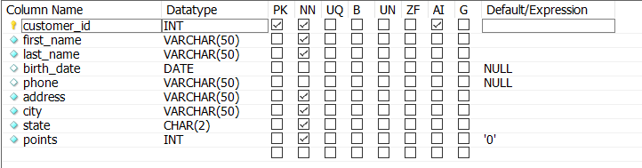
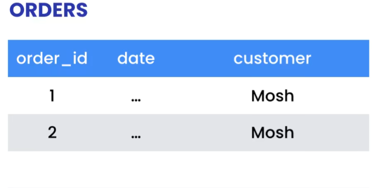
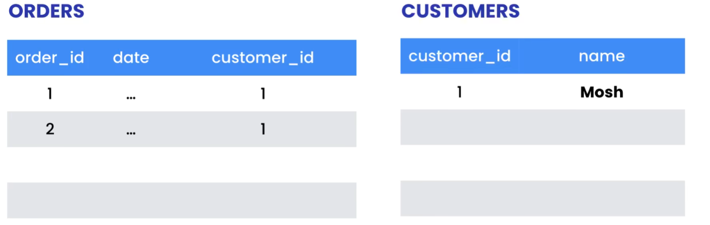
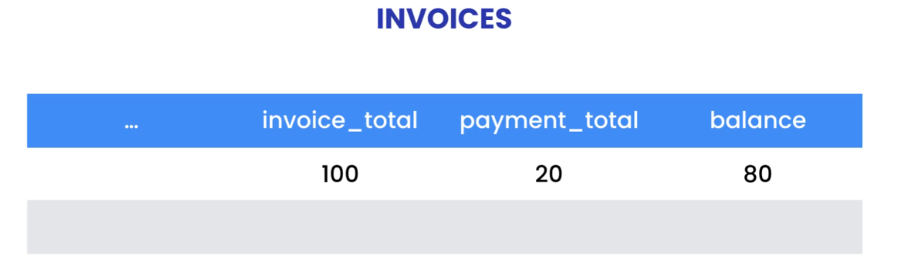

## sql不区分大小写

如题

## 注释

SQL中的注释为 --

```SQL
SELECT * 
FROM customers
-- WHERE customer_id = 1
ORDER BY first_name
```

## 引号

用引号“”或‘’可将名字看作整体，从而内部可加空格

```SQL
SELECT 
	first_name, 
	last_name, 
    points / 10 AS 'discount factor', -- 别名空格加""
    points
FROM customers
-- WHERE customer_id = 1
ORDER BY points DESC
```

## 常用运算符

### IN

```SQL
SELECT *
FROM products
WHERE quantity_in_stock IN (49,38,72)
```

### BETWEEN

```SQL
SELECT *
FROM customers
WHERE birth_date BETWEEN '1990-01-01' AND '2000-01-01'
```

### LIKE

```SQL
SELECT *
FROM customers
WHERE last_name LIKE 'b%' -- 通配符： %代表任意个数的字符，_代表任意一个单字符
```

### REGEXP

(regular expression)使用正则

```SQL
SELECT *
FROM customers
WHERE last_name REGEXP 'field$|^mac|rose' -- 以field结尾，或以mac开头，或包含rose
-- ^ beginning
-- $ end
-- | logical or
-- [abcd] range
-- [a-h]
```

### IS NULL
```SQL
SELECT *
FROM customers
WHERE phone IS NULL
```

### ORDER BY
默认主键升序
```SQL
SELECT *
FROM customers
ORDER BY state DESC, first_name -- 按state降序，break tie 按 first_name 升序
```

### LIMIT和OFFSET
```SQL
SELECT *
FROM customers
LIMIT 3 OFFSET 6 -- 只要三个数据，跳过前6个数据
-- 可简写成 LIMIT 6, 3
```

## JOIN

### INNER JOIN 内连接

默认JOIN即为INNER Join
```SQL
SELECT order_id, o.customer_id, first_name, last_name
FROM orders AS o -- 别名， AS可省略
join customers AS c
	on o.customer_id = c.customer_id
```

### 跨表连接

需要给不在当前表的table前面指名前缀
```SQL
USE sql_store;

SELECT order_id, p.product_id, name, quantity, o.unit_price
FROM sql_inventory.products AS p
JOIN order_items AS o
	ON p.product_id = o.product_id
```

### Self Join 自连接

类似于join其他表，但必须使用别名
```SQL
SELECT 
	e1.employee_id,
    e1.first_name AS serveASAS
    e2.first_name AS manager
FROM employees AS e1
JOIN employees AS e2
	ON e1.reports_to = e2.employee_id
```
### 多表连接
按顺序JOIN即可
```SQL
SELECT 
	o.order_id,
    o.order_date,
    c.first_name,
    c.last_name,
    os.name AS status
From orders as o
JOIN order_statuses as os
	ON o.status = os.order_status_id
JOIN customers as c
	ON o.customer_id = c.customer_id
```

### 复合连接条件

**复合主键:包含超过一列**
当无法只通过一列来作为unique_id识别数据时，可使用tuple联合多列数据来唯一识别。
通过AND连接多个Join条件即可
```SQL
SELECT *
FROM order_items oi
JOIN order_item_notes oin
	ON oi.order_id = oin.order_Id 
	AND oi.product_id = oin.product_id
```

### 隐式连接语法
不建议使用，没有WHERE语句时为两表的笛卡尔积
```SQL
SELECT *
FROM orders AS o, customers AS c
WHERE o.customer_id = c.customer_id
```
### OUTJOIN外连接

**分LEFT JOIN 和 RIGHT JOIN**

LEFT JOIN 返回所有左表的记录无论是否符合join on 的条件, 不满足的返回null
RIGHT JOIN 同理

```SQL
SELECT 
	c.customer_id,
    c.first_name,
    o.order_id
FROM orders AS o
LEFT JOIN customers AS c
	ON o.customer_id = c.customer_id
```

多表外连接时，最好统一连接方式，不要一会左连接，一会右连接

### USING字句

如果需要join两表的两列名完全相同，可用一个更简洁的using语句代替on语句, 同样适用于复合主键

```SQL
SELECT *
FROM orders AS o
JOIN customers AS c
	-- on o.customer_id = c.customer_id
    USING (customer_id)
LEFT JOIN shippers AS s
	-- on o.shipper_id = s.shipper_id
	-- AND o.name = s.name
    USING (shipper_id, name)
```

### 自然连接

数据库自己看着办，通过列名相同连接, 可能产生意外结果，不建议使用

```SQL
SELECT *
FROM orders AS o
NATURAL JOIN customers c
```

### 交叉连接

生成笛卡尔积，全连接

```SQL
SELECT count(*)
FROM customers c
CROSS JOIN products p
```

### Union联合

将两张具有相同列数量的表, 合并成同一张表
UNION 去重，UNION ALL 不去重

```SQL
SELECT 
	o.order_id,
    o.order_date,
    'Active' AS status
FROM orders AS o
WHERE order_date >= '2019-01-01'
UNION -- 将二表连接
SELECT
	o.order_id,
    o.order_date,
    'Archived' AS status
FROM orders AS o
WHERE order_date < '2019-01-01'
```

## 插入、更新、删除数据

### 表设计参数解释

  

* **Datatype:** `VARCHAR（50）`指最长长度为50的可变字符串，`CHAR(2)` 为 固定长度为2的字符串，若不足则会填补空字符。
* **PK** 表明该列为主键，具有唯一标识作用
* **AI** 指自增，通常用于主键
* **NN** 表示该列是否支持空值，即是否为必填项
* **Default/Expression** 表示该列的默认值

### 插入单行

使用**INSERT INTO - VALUES** 向一个表插入一行

```SQL
-- 向表插入完整的一行，NULL需该列允许空值；DEFAULT需该列设置了默认值
-- 对于主键若勾选自增，则DEFAULT为自增
INSERT INTO customers
VALUES (
	DEFAULT, 
	'John', 
    'Smith', 
    '1990-01-01',
    NULL,
    'address',
    'city',
    'CA',
	DEFAULT)
```

```SQL
-- 指名要赋值的列，这样就不用显性指名NULL和DEFAULT
INSERT INTO customers(
	first_name,
    last_name,
    birth_date,
    address,
    city,
    state)
values (
	'John', 
    'Smith', 
    '1990-01-01',
    'address',
    'city',
    'CA')
```

### 插入多行

VALUES 多行，分割即可

```SQL
INSERT INTO shippers (name)
VALUES ('Shipper1'),
	   ('Shipper2'),
       ('Shipper3')
```

### 向多表插入数据

为了使多表的主键id相同，MySQL内置函数`LAST_INSERT_ID()` -> 返回我们插入新行时MySQL自增生成的主键值

```SQL
INSERT INTO orders (
	customer_id,
    order_date,
    status)
VALUES (1, '2019-01-02', 1);

INSERT INTO order_items 
VALUES (LAST_INSERT_ID(), 1, 1, 2.95),
	   (LAST_INSERT_ID(), 2, 1, 3.95)
```

### 表复制

**使用 CREATE TABLE ... AS** 可以快速复制表，但新表中关于旧表的主键和自增将被抹去

```SQL
CREATE TABLE orders_archived AS
SELECT * FROM orders
```

**将SELECT语句作为INSERT INTO 的子语句** 可插入想要的范围数据

```SQL
INSERT INTO orders_archived
SELECT * 
FROM orders
WHERE order_date < '2019-01-01'
```

### 更新行

使用**UPDATE-SET**来更新数据

```SQL
UPDATE invoices
SET payment_total = 10,
	payment_date = '2019-03-01'
WHERE invoice_id = 1
```

注：`MySQL Workbench` 默认运行在安全更新模式下，一次只允许更新一行数据，多行会报错
  
关掉即可。

**在UPDATE中使用子查询**, 对子查询加括号（）

```SQL
UPDATE orders
SET comments = 'Gold customer'
WHERE customer_id IN 
			(SELECT customer_id
			FROM customers
			WHERE points > 3000)
```

### 删除行

使用**DELETE FROM**语句

```SQL
DELETE FROM invoices
WHERE invoice_id = 1
```

同样也可使用子查询

```SQL
DELETE FROM invoices
WHERE invoice_id = (
		SELECT *
		FROM clients
		WHERE name = 'Myworks'
)
```

## 聚合函数

### 常用聚合函数——MAX(), MIN(), AVG(), SUM(), COUNT()

注：这些聚合函数只计算非空值，不会去除重复值（若要，使用DISTINCT）

```SQL
SELECT 
	max(invoice_total) AS highest,
    min(invoice_total) AS lowest,
    avg(invoice_total) AS average,
    sum(invoice_total) AS sum,
    count(DISTINCT invoice_total) AS count,
    count(*) as total_record -- count(*) 返回总共的记录数，不会不管空值
FROM invoices
```

### GROUP BY

根据“By”指定的规则对数据进行分组

```SQL
select 
	client_id,
	sum(invoice_total) as total_sales
from invoices
where invoice_date >= '2019-07-01'
group by client_id
order by total_sales DESC
```

### HAVING

HAVING”其用法和含义与“WHERE”关键词相似,但具有更高级别的限定性。在SELECT语句中,“HAVING”关键词用于过滤聚合函数的结果。
HAVING 必须在GROUP BY后面使用

**和WHERE的区别：**

* WHERE 在GROUP BY 分组前过滤，可以使用所有表中的列名
* HAVING 在GROUP BY 分组后过滤，只能使用SELECT选中的列

```SQL
SELECT
	client_id,
    sum(invoice_total) AS total_sales
FROM invoices
-- where total_sales > 500 不能使用where, 因为group by在之后，现在还没有 total_sales的数据
GROUP BY client_id
HAVING total_sales > 500
```

### ROLLUP

**分组汇总**
ROLLUP函数是SQL中用于**在GROUP BY子句后面**从而**生成合计行的函数**。它可以在GROUP BY子句中的列上创建一个合计行,从而提供总计, **只总计聚合函数作用的列**, 对于每一个GROUP都会总计。

**MySQL独有**

```SQL
SELECT 
	client_id,
    sum(invoice_total) AS total_sales -- 只有这行会被总计
FROM invoices
GROUP BY client_id WITH ROLLUP
```


## 事务和并发

### 创建事务TRANSACTION

使用 

```SQL
START TRANSACTION;
--....（执行语句）；
COMMIT;
```

符合ACID特性。

当某些情况下我们想进行一些错误检查，并手动退回事务，此时使用

```SQL
START TRANSACTION;
--  ....（执行语句）；
ROLLBACK;
```


### 并发和锁定

默认状态下对事务正在操作的table加锁

### 常见并发问题

* **Lost update(丢失更新)** 当两个事务尝试更新相同的数据并且没有上锁时, 较晚提交的事务会覆盖较早事务做的更改 **--解决方法：使用锁，防止两个事务同时更新相同的数据**
* **Dirty Reads(脏读)** 一个事务读取到了另一个事务尚未提交的数据。**--解决方法：使用读以提交隔离级别，事务只能读取已提交的数据。**
* **Non-repeating Reads(不可重复读)** 在一个事务中读取某个数据两次，但两次得到的结果不同。--**解决方法: 使用可重复读隔离级别，事务在首次读取时创建原始快照, 确保该事务在运行过程中其他事务对数据的更改对其不可见**
* **Phantom Reads(幻读)** 当一个事务查询某个范围内的数据时，另一个事务在该范围内插入了新的数据，当第一个事务再次读取该范围的数据时，会发现多了一些原本不存在的记录，这种现象被称为幻读。**--解决方法：确保第一个事务运行时没有任何其他事物同样在运行--序列化隔离级别**

### 四种隔离级别

| |丢失更新|脏读|不可重复读|幻读|
|--|:--:|:--:|:--:|:--:|
|**读未提交隔离级别**| | | | |
|**读已提交隔离级别**| |$\checkmark$ | | 
|**可重复读隔离级别**|$\checkmark$|$\checkmark$ |$\checkmark$ | |
|**序列化隔离级别**|$\checkmark$|$\checkmark$ |$\checkmark$ |$\checkmark$ |

 MySQL默认隔离等级为可重复读

 查看和设置隔离等级

```SQL
SHOW VARIABLES LIKE 'transaction_isolation' -- 查询隔离级别
SET (SESSION/GLOBAL) TRANSACTION ISOLATION LEVEL SERIALIZABLE; -- 设置隔离级别，
-- 选填SESSION时设置当前会话或连接中未来事务的隔离级别。
--选填GLOBAL时为设置全局隔离级别，对于未来所有事务。
--都不填时为为下一个事务设置隔离等级。
```

**READ UNCOMMIT 脏读例子**

```SQL
-- 窗口一
USE sql_store;
SET TRANSACTION isolation level read uncommitted; -- 设置隔离级别
select points -- 会读到未提交的20
from customers
where customer_id = 1

-- 窗口二
use sql_store;
start transaction;
update customers
set points = 20
where customer_id = 1;
rollback;
```

**READ COMMIT 不可重复读例子**

```SQL
-- 窗口一
USE sql_store;
SET TRANSACTION isolation level read committed; -- 设置隔离级别 
start transaction;
select points -- 第一次读，读到原始数据
from customers
where customer_id = 1;
select points -- 第二次读，会读到20
from customers
where customer_id = 1;
commit;

-- 窗口二
use sql_store;
start transaction; -- 在两次读之间提交事务
update customers
set points = 20
where customer_id = 1;
commit;
```

**REPATABLE READ 幻读例子**

```SQL
-- 窗口一
USE sql_store;
SET TRANSACTION isolation level repeatable read; -- 设置隔离级别 
start transaction;
select * -- 第一次读
from customers
where state = 'VA';
select *  -- 第二次读，由于是可重复读隔离级别，两次读取都是第一次的原始快照，因此相同.
from customers
where state = 'VA';
commit;


-- 窗口二
use sql_store;
start transaction; -- 在两次读之间更新
update customers
set state = 'LA'
where customer_id = 1;
commit;
```

### 死锁

```SQL
-- 窗口一
USE sql_store;
start transaction;
update customers set state = 'VA' where customer_id = 1;
update orders set status = 1 where order_id = 1;
commit;

-- 窗口二
USE sql_store;
start transaction;
update orders set status = 1 where order_id = 1;
update customers set state = 'VA' where customer_id = 1;
commit;
```

  

**减少死锁的方法：**

* 在更新多条记录的时候遵照相同的顺序
* 尽量简化事务，缩短运行时间，减少冲突可能
* 对于大表查询的事务，经常需要运行较长时间，尽量避免在高峰期运行。


## 数据库设计

### 数据属性尽量拆分细化

如姓名分为姓氏和名字，地址分为街道，城市，邮政编码，国家，利于后续查询。

### 主键（Primary key）

主键是唯一标识给定表里每条记录的列, 主键不应更改，不应过长（在多表都出现占用太多内存）。
一般选用自增的id。

### 外键（Foreign Key）

外键是在一张表中引用了另一张表主键的那列。如果是复合主键，则要引用全部。
对于一个表，如果没有子表引用它，则一般将外键作为复合主键，如果有子表，则另加一列id作为主键。

### 外键约束

**父表主键更新时：**

* CASCADE(级联): 当主键改变时，引用的外键一起更新。
* RESTRICT(限制): 拒绝更新
* SET NULL: 外键设为空值 --多数情况下不要选用，产生孤儿数据（没有父表信息）
* NO ACTION：同限制，无改变。

**父表主键删除时：**

* CASCADE(级联): 当主键删除时，对应外键的记录一同删除。
* RESTRICT(限制): 拒绝更新
* SET NULL: 外键设为空值 --多数情况下不要选用，产生孤儿数据（没有父表信息）
* NO ACTION：同限制，无改变。

一般设置更新为 CASCADE, 删除取决于级联删除是否会导致数据丢失。由业务情况决定。

### 第一范式

第一范式要求一行中的每个单元格都应该有单一值（不应有多个值，用逗号分隔），且不能出现重复列

解决方法，建一个新表，与此表建立多对多的关系。--多对多关系需要在两表间新建一个表来实现（链接表）。

注：链接表实现多对多关系在关系型数据库非常常见，一般只包含两个引用父表的外键作为复合主键，或自己另加一行id作为主键（如果还有子表）。

### 第二范式

（1）必须符合第一范式
（2）第二范式要求每张表都应该有一个单一目的，换句话说, 一张表中的每一列都应该在描述该表代表的实体(有点像面向对象)

即尽量不要出现外键id之外的重复(减少内存消耗)，有重复就建新表。

  

$$\downarrow$$

  


### 第三范式

（1） 满足第二范式
（2） 表中的列不应派生于其他列的计算结果，这样更新一列还需更新关联的其他列，冗余易错。

  

$$\underset{\text{drop balance colum}}{\downarrow}$$

  


### 存储引擎

最常用的两个存储引擎是MyISAM和InnoDB

MyISAM 5.5之前的引擎，之后更高级的InnoDB引擎取代

* `InnoDB`特点： 事务安全（支持ACID特性）、支持外键、支持行级锁、支持MVCC（多版本并发控制）、支持崩溃恢复。适用场景： 绝大多数在线事务处理（OLTP）系统，要求高并发、高可靠性，以及需要事务支持的场景。它是MySQL 5.5版本以后的默认存储引擎。
* `MyISAM`特点： 访问速度快，占用空间小，不支持事务、不支持外键、不支持行级锁。适用场景： 适合以读操作为主，对事务完整性要求不高的应用，如数据仓库、日志系统等。
* `MEMORY（HEAP）`特点： 将数据全部存储在内存中，访问速度极快，但数据不持久化，重启数据库后数据丢失。适用场景： 用于临时表、缓存等，对数据安全性要求不高的场景。

## 索引

**在多数情况下，索引很小，足以放进内存中。**

**建立索引的参考：不应基于表创建索引，而是基于查询创建索引。
索引的目的：加快运行较慢的查询** 没有索引时进行全表扫描

### 创建索引

```SQL
CREATE INDEX idx_state ON customers (state);
-- 对customers表的state列建立索引
```

注：

1. 对于主键，MySQL会自动对其建立索引，也称聚簇索引。每个表最多只有一个聚簇索引。
2. 每当我们为两个表创建一组关系时，MySQL会自动给外键创建索引，以便于快速链接表。

### 查看索引

```SQL
SHOW INDEX IN customers;
```

### 前缀索引

对于在字符串（CHAR, VARCHAR, TEXT, BLOB）上建立索引，使用字符串的前缀几个字符建立索引以减小内存消耗。

```SQL
CREATE INDEX idx_lastname ON customers(last_name(5));
-- 指定索引选用的前缀的长度

-- 调参，通过比较不同前缀下的可以辨别的数量，找到最佳兼顾内存和性能的前缀长度。
SELECT 
	COUNT(DISTINCT LEFT(last_name, 1)),
    COUNT(DISTINCT LEFT(last_name, 5)),
    COUNT(DISTINCT LEFT(last_name, 10))
FROM customers;
```

### 全文索引

该索引包含整个字符串而非些许前缀

```SQL
-- 创建全文索引
CREATE FULLTEXT INDEX idx_title_body ON posts(title, body);

-- 利用内置函数MATCH()和AGAINST（）来使用全文索引查找
-- 默认模型查询
SELECT *
FROM posts
WHERE MATCH(title, body) AGAINST('react redux')；
-- 返回title或body中包含一个或两个关键字的结果，这些关键词可以是任何顺序，也可被一个或多个单词分割。

-- BOOLEAN MODE查询(搜索引擎模式)
SELECT *
FROM posts
WHERE MATCH(title, body) AGAINST('react -redux +form' IN BOLLEAN MODE)；
-- 返回title或body中包含react 且不包含redux的结果。
```

`MATCH(title, body) AGAINST('react redux')` 返回相关性得分

对于篇幅较长的字符串列，如博客正文、产品描述，建立全文索引。
对于较短的，如名字、地址，使用前缀索引即可。

### 复合索引


假设此时在state和points上都有各自的索引
当进行复合查询时，mysql只会选用一个索引如idx_state, 但该索引中没有points信息，因此还得对points进行全表扫描，为加快效率，可建立复合索引。
```SQL
SELECT customer_id 
FROM customers
WHERE state = 'CA' AND points > 1000;

-- 建立复合索引
CREATE INDEX idx_state_points ON customers(state, points);
```

MySQL中。一个索驯中最多可以包含16列，开发中一般4~6。根据业务逻辑和查询而定。
注：

* 建立的复合索引记得把单列索引删掉
* MySQL中建立索引时会自动把主键包含其中，因此太多的单列索引会浪费很多空间（重复的主键）。
* 建立复合索引时，对于其中的列顺序，一般：
  * 把更频繁使用的列排在前面
  * 把基数(Cardinality)更高的列排在前面（基数指索引中唯一值的数量）
  * 实际中，应分别查看不同索引下查询的效果（通过EXPLAIN）来选择最合适的索引。

### 删除索引

```SQL
DROP INDEX idx_state ON customers;
```

### 强制使用想用的索引

在FROM 和 WHERE之间使用USE INDEX(想要使用的索引名)

```SQL
SELECT *
FROM customer_id
USE INDEX(idx_lastname_state)
WHERE state = 'NY' AND last_name LIKE 'A%';
```

注：= 的约束性强于LIKE

### 索引无效

当出现MySQL使用了索引，但是是全索引扫描（快于全表扫描，因为不涉及磁盘I/O读取每个记录）时，需重写查询以更好的利用索引。

```SQL
SELECT customer_id 
FROM customers
WHERE state = 'CA' OR points > 1000 ;
```

$$\downarrow$$

```SQL
SELECT customer_id 
FROM customers
WHERE state = 'CA'
UNION
SELECT customer_id 
FROM customers
WHERE points > 1000 ;
```

当在表达式中使用列时，MySQL也可能无法以最优方式使用索引。

```SQL
SELECT customer_id 
FROM customers
WHERE points +10 >2010;
```

$$\downarrow$$

```SQL
SELECT customer_id 
FROM customers
WHERE points >2000;
```

### 使用索引排序

ORDER BY 子句中的列的顺序，应该与索引中的列的顺序相同。否则会进行全表扫描。