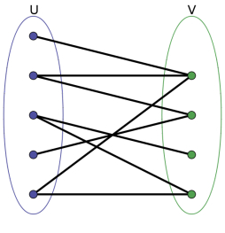

## 快速幂

```python
# 求 (a**b) % mod
def f(a, b, mod):
    ans = 1
    while(b):
        if b&1:
            ans *= a
            ans %= mod
        b >>= 1
        a *= a
        a %= mod
    return ans
```

## 组合数

```python
# 预处理 fac 和 ifac
fac = [1] * (n+1), ifac = [1] * (n+1)
for i in range(2,n+1):
    fac[i] = fac[i-1] * i % mod
    ifac[i] = pow(fac[i], mod - 2) # 使用快速幂

'''求C_a^b % mod'''
def C(a,b,mod):
    return fac[a] * ifac[b] % mod * ifac[a-b] % mod
```

## 埃拉托斯特尼筛法求素数

```python
# 预处理 is_prime
is_prime = [True] * (n+1)
p = 2 # 从 2 开始
while p*p <= n:
    if is_prime[p]: # 找到最近未被标记为非质数的质数
        for i in range(p*p, n+1, p): # 标记所有是它的倍数且>=p*p的数字
            is_prime[i] = False
    p += 1

'''判读 k 是否是质数'''
def isPrime(k):
    return is_prime[k]
```

## 二分图匹配-匈牙利算法

**二分图**：

* 可以将图中所有的点分为A、B两个集合，从而使得集合内部任意两个点都不直接相连。
* 常见为男，女配对，偶数，奇数配对。
  

**一个二分图中的最大匹配数等于这个图中的最小点覆盖数**

**最大匹配**

* 即需要给出一种分配策略，使得产生尽可能多的符合条件的配对

**最小点覆盖**

* 找到最少的一些点，使二分图所有的边都至少有一个端点在这些点之中。倒过来说就是，删除包含这些点的边，可以删掉所有边。

```python
    graph = make_graph() # 根据题意构建图
    visited = set() # //记录右侧元素是否已被访问过
    mapRight = dict() #  //记录当前右侧元素所对应的左侧元素
    '''递归匹配'''
    def dfs(n_left: int)->bool:
        for n_right in graph[n_left]:
            # 访问过则跳过
            if n_right in visited:
                continue
            visited.add(n_right)
            # 如果暂无匹配，或者原来匹配的左侧元素可以找到新的匹配
            if n_right not in mapRight or dfs(mapRight[n_right]):
                mapRight[n_right] = n_left # 当前left侧元素成为当前right侧元素的新匹配
                return True # 返回匹配成功
        return False # 循环结束，仍未找到匹配，返回匹配失败
    '''匈牙利算法'''
    def Hungarian()->int:
        ans = 0
        for n_left in leftLst:
            visited.clear() # 重置vis数组
            if dfs(n_left):
                ans += 1
        return ans
```

## 中心扩散法求最长回文子串

最长回文子串的中心扩散法，遍历每个字符作为中间位，进行左右比较

```python
s = list(input())

def longest(s:list[str], i, j):
    while i >= 0 and j < len(s) and s[i] == s[j]:
        i -= 1
        j += 1
    return j - i + 1

maxLen = 0
for i in range(len(s)):
    # ABA型
    len1 = longest(s, i, i)
    # ABBA型
    len2 = longest(s, i, i+1)
    maxLen = max(maxLen, max(len1, len2))

print(maxLen)

```

## KMP字符串匹配算法

用于在字符串（也叫主串）中的模式串（也叫字串）定位问题，常见的有“求子串出现的起始位置”、“求子串的出现次数”等。

**next前缀表**：
前缀表是一张表(或者直接理解为一个数组)，表中记录的是字符串中的每个子串的**最大相等前后缀的长度**
例子：
```sql
T = 'aabaaf'
第一个子串是t0=“a”，易知该子串没有前缀也没有后缀，故next[0]=0
第二个子串是t1=“aa”，该子串的前缀为"a"，后缀也为"a"，故next[1]=1
第三个子串是t2=“aab”，该子串的后缀中一定会有"b"，前缀中一定不含有"b"，则其没有相等的前后缀，故next[2]=0
第四个子串是t3=“aaba”，该子串的最大相等前后缀为"a"，长度为1，故next[3]=1
第五个子串是t4=“aabaa”，该子串的最大相等前后缀为"aa"，长度为2，故next[4]=2
第六个子串是t5=“aabaaf”，该子串的后缀中一定会有"f"，前缀中一定不含有"f"，则其没有相等的前后缀，故next[5]=0
next = [0,1,0,1,2,0]
```

```python
'''计算Next前缀表'''
def getNext(p):       
    j = 0 # j指针指向的是前缀末尾  
    for i in range(1,len(p)):  # i指针指向的是后缀末尾
        while j>0 and p[i]!=p[j]:   # 前后缀不相同且j还没减到0
            j=Next[j-1]               # 回溯一步, 去找j前一位的最长相等前后缀
        if p[i]==p[j]: # 前后缀相同，j指针后移
            j += 1 # j指针后移
            Next[i] = j # 更新next数组

'''KMP 算法'''
def kmp(s,p):
    j=0 # p中指针
    for i in range(0,len(s)):   #匹配S和P的每个字符,S的i指针，它不回溯，用for循环一直往前走。
        while j>0 and s[i]!=p[j]:   #失配了
            j=Next[j-1]           #j回溯到Next[j-1]位置
        if s[i]==p[j]:      #当前位置的字符匹配，继续
            j+=1            # j 后移一格
            'dong somthing u need'
        if j==len(p): # 已经遍历完字串P
            'do somthing'
            '两种回溯方式，取决于题意'
            # j = 0
            # j = Next[j-1]
    'return somthing u need'

s=input() # 主串
p=input() # 字串
Next = [0] * (len(p)) # 字串的next数组, next[1] = 0，表示当匹配失败时，模式串应该回溯到第一个字符。
# Next[0] = 0 # 模式串的第一个字符不参与匹配
getNext(p)
print(kmp(s, p))
```

## 离线树状数组

频繁的**单点更新**使得普通的前缀和数组**区间查询**效率变低，此时需使用树状数组。

```python
class FenwickTree:
    def __init__(self, size):
        self.size = size
        self.tree = [0] * (size + 1) # 树状数组通常从索引1开始

    def lowbit(self, index):
        return index & -index

    '''将索引index的值增加delta'''
    def update(self, index, delta):
        while index <= self.size:
            self.tree[index] += delta
            index += self.lowbit(index)

    '''查询索引1到index的和'''
    def query(self, index):
        result = 0
        while index > 0:
            result += self.tree[index]
            index -= self.lowbit(index)
        return result
```

## 差分数组

针对一个数组，频繁的，每次对一个区间中的元素进行增加或删除。

```python
nums = list(map(int, input().split())) # 原数组
diff_array = [0] * len(nums) # 差分数组

# 对nums数组中的相邻元素进行两两做差（用右边减去左边），然后再在开头补上一个nums[0]就得到了它的差分数组。
diff_array[0] = nums[0]
for i in range(1, len(nums)):
    diff_array[i] = nums[i] - nums[i-1]
diff_array = nums[0] + 

# 对原数组nums的区间 i 到 j 都增加一个数 x 等于 对差分数组diff_array中的diff_array[i] += x，diff_array[j+1] -= x。减小反之
diff_array[i] += x
diff_array[j+1] -= x

# 通过差分数组还原初始数组
for i in range(1, len(nums)):
    nums[i] = num[i-1] + diff_array[i]

```

## 最短路径算法

### Dijkstra算法

求单源到图中所有节点的最短距离, 当有边的权值是负值, 可能错误

```python
import queue
import heapq

Graph = make_graph() # 给定的图
start_node = i # 起始点
node_num = n # 总点数

path_len = [float('inf')] * n # start_node 到各节点的初始距离设置为无穷大
path_len[start_node] = 0  # 到自身设置为0
up_node_info = {} # 记录上游节点，如需保存路径，{节点编号：上游节点编号}
visited = set() # 标记已访问的节点

pq = queue.PriorityQueue() #获取距离start_node最近的节点
pq.put((0,start_node)) # 初始添加start_node
# 也可使用 heapq 来建立pq
'''
pq = []
heapq.heappush(pq, (0, start_node))
'''

# 队列非空时（start_node到各个节点的最短距离未完全确定）
while pq:
    l, u = pq.get()
    visited.add(u)
    for v in Graph[u]:
        # Dijkstra 每个节点只访问一次
        if v in visited:
            continue
        # 找到比当前保存的最短路径长度更小的路径，则更新
        if path_len[u] + l(u,v) < path_len[v]:
            up_node_info[v] = u
            path_len[v] = path_len[u] + l(u,v)
            pq.put((path_len[v], v))
```

### Bellman-Ford算法

```python
def bellman_ford(graph, start):
    n = len(graph) # 节点数量
    distance = [float('inf')] * n
    distance[start] = 0

    # 进行n-1次松弛操作
    for _ in range(n - 1):
        update = False # 用于提前结束循环
        for u, v, weight in graph: # 对每一条边进行松弛操作
            if distance[u] + weight < distance[v]:
                distance[v] = distance[u] + weight
                update = True
        # 如果枚举一次所有边，没有点更新最短路径，则说明所有点都已取得最短路径，则可以结束循环；
        if not update:
            break
```

## 背包问题

有一个容量为 $W$ 的背包，要用这个背包装下物品的价值最大，这些物品有两个属性：体积 $w$ 和价值 $v$。


### 0 - 1背包

**每件物品只能用一次**，选第i个物品的方案和不选择第i个物品的方案

**例1 给定一个大小为W的背包，背包最多能装多少价值**

**状态转移公式为：**
$$dp[i][j] = max(dp[i-1][j] + dp[i-1][j-w[i]] + v[i])$$

```python
# W 为背包总体积
# N 为物品数量
# weights 数组存储 N 个物品的重量
# values 数组存储 N 个物品的价值
def knapSack(W:int, N:int, weights:list[int], values:list[int]):
    # 定义一个二维数组 dp 存储最大价值，其中 dp[i][j] 表示前 i 件物品体积不超过 j 的情况下能达到的最大价值。
    dp = [[0 for _ in range(W+1)] for _ in range(N+1)]
    for i in range(1, N+1):
        for j in range(1, W+1):
            dp[i][j] = dp[i-1][j] # 第 i 件物品 没添加 到背包
            if j >= weight[i-1]: # 第 i 件物品 添加 到背包
                dp[i][j] = max(dp[i][j], dp[i-1][j-weights[i-1]] + values[i-1])
    return dp[N][W]
```

**例2 给定一个大小为W的背包，有多少种组合方式能把背包装满？**

**状态转移公式为：**
$$dp[i][j] = dp[i-1][j-w[i]] + dp[i-1][j]$$

```python
def knapSack(W:int, N:int, weights:list[int]):
    # 定义一个二维数组 dp 存储组合数，其中 dp[i][j] 表示前 i 件物品装满体积为j背包的组合情况
    dp = [[0 for _ in range(W+1)] for _ in range(N+1)] 
    # 背包为0时，不需要放东西进去dp[i][0] = 1
    for i in range(n):
        dp[i][0] = 1
    
    for i in range(1, N+1):
        for j in range(1, W+1):
            unSelect = dp[i-1][j] # 第 i 件物品 没添加 到背包
            if j >= weight[i-1]: # 第 i 件物品 添加 到背包
                select = dp[i-1][j-weight[i-1]] 
            else:
                select = 0
            dp[i][j] = select + unSelect
    return dp[N][W]
```

### 完全背包

物品的数量是**无限**的，可以选择任意多个相同的物品放入背包。
同样分为选第i个物品的方案和不选择第i个物品的方案，区别在于选择时的递推为$dp[i][j-w[i]] +v[i]$ 而非 $dp[i-1][j-w[i]] +v[i]$，即$i$ 不衰退为$i-1$

```python
def knapSack(W:int, N:int, weights:list[int], values:list[int]):
    dp = [[0 for _ in range(W+1)] for _ in range(N+1)]
    '''对dp进行一些base case 的初始化'''
    for i in range(1, N+1):
        for j in range(1, W+1):
            unselect = dp[i-1][j] # 第 i 件物品 没添加 到背包
             # 第 i 件物品 添加 到背包
            select = 0 if j <w[i] else dp[i][j-weights[i-1]] + values[i-1]
            dp[i][j] = '''do something with select and unselect'''
    return dp[N][W]
```

完全背包中，会牵扯两个不同的问题：**组合问题和排列问题**。
* 对于组合问题，就是规定一批相同的元素，不同的排列代表同一个结果, 实现时**先遍历物品，再遍历背包**，这样子可以让dp只记录某一结果中的一种情形, 因为物品顺序被固定。
* 而排列问题，就是规定一批相同的元素，不同的排列代表不同的结果，实现时**先遍历背包，再遍历物品**，这样子可以让dp记录所有的排列出现的情况，在不同容量下，都将各个物品从头遍历了一遍，就会得到所有的排列情况。

### 多重背包

多重背包是对每种**物品的数量进行限制**，第i种物品的个数最多为$s[i]$个

实现方式是在01背包实现的基础上，遍历时候，在最内层设置一个for循环，寻找从一个都不选到选$s[i]$个第$i$个物品时。

```python
def knapSack(W:int, N:int, w:list[int], v:list[int]，s: list[int]):
    dp = [[0 for _ in range(W+1)] for _ in range(N+1)]
    '''对dp进行一些base case 的初始化'''
    for i in range(1, N+1):
        for j in range(1, W+1):
            # 一个都不选一直到选s[i]个
            for k in range(s[i]+1):
                currCase = 0 if j < k*w[i] else dp[i - 1][j - k * w[i]] + k * v[i]
                dp[i][j] = "do something with currCase"
    return dp[N][W]
```

### 分组背包

有$N$组物品和一个容量是$V$的背包。
每组物品有若干个，同—组内的物品最多只能选一个。
即在01背包问题的基础之上，多了一个在每个组中选出最优的那个物品（或者不选）。

```python
def knapSack(W:int, N:int, w:list[int], v:list[int]，s: list[int]):
    dp = [[0 for _ in range(W+1)] for _ in range(N+1)]
    '''对dp进行一些base case 的初始化'''
    for i in range(1, N+1):
        for j in range(1, W+1):
            for k in range(s[i]): # s[i]表示第i组物品的个数
                # 对于第i组第k个物品，比较选和不选
                if j >= w[i][k]:
                    dp[i][j] = max(dp[i][j], dp[i-1][j-w[i][k]] + v[i][k])
    return dp[N][W]
```

### 依赖背包

常见于树形结构上面, 如果你要选择$v$节点的物品，那么必须先选择$v$的父亲节点上的物品(所谓的依赖关系)
定义 $dp[u][j]$ 表示以u为根节点，背包剩余容里为j, 则其由子节点更新而来。
每次对于给定的$u$ 和 $v$, 遍历背包大小 $i$ 和 分配给$s$的背包空间$k$:
$$f[u][i] = max(f[u][i],f[u][i-k]+f[s][k]);//s是u的子节点$$
