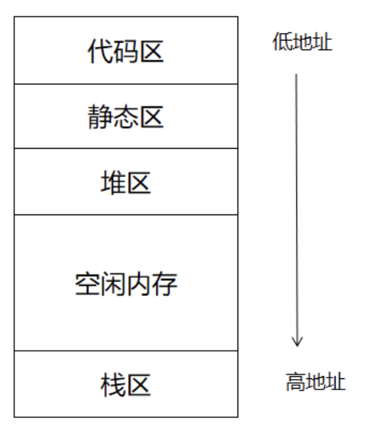

## 进程与线程

**进程：**

* 进程是计算机中**正在运行的程序的实例**。
* 进程是**操作系统进行资源分配和调度的最小单位**。
* 每个进程都有自己独立的地址空间（包括代码区、静态区（数据区）和堆栈区），并且可以拥有多个线程。
  **典型的地址空间划分如下：**
  
  * **代码区：** 保存我们写的代码，更准确的是编译后的可执行机器指令。**静态分配**， **线程共享**
  * **静态区（数据区）：** 该区的数据对象包括**全局变量**和编译器产生的数据（如用于支持垃圾回收的信息等）。**静态分配**，**线程共享**
  * **堆：** 存储`malloc`或者`new`出来的动态数据，**堆空间从低地址向高地址方向增长**， **动态分配**，**线程共享**（只要知道变量的地址，即指针即可访问）
  * **栈：** 每个线程都有自己独立的、私有的栈区。每个线程的栈帧中保存了**函数的返回值**、**调用其它函数的参数**、该函数使用的**局部变量**、该函数使用的**寄存器信息**以及**程序计数器**。**栈空间从高地址向低地址方向增长**，**动态分配**，**线程私有**。
* 进程之间是相互独立的，它们不能直接共享数据，必须通过**进程间通信**(IPC)来实现数据交换。
* 进程的创建、销毁与切换存在着较大开销, 但相对比较稳定安全。

**线程：**

* 线程是**CPU调度的最小单位**，是**最小的执行单元**。
* **一个进程至少包含一个主线程**，也可以有更多的子线程。
* 多个线程共享所属进程的资源（锁机制），同时线程也拥有自己的专属资源、**拥有自己的栈空间**。
* 线程间通信主要通过共享内存，上下文切换很快，资源开销较少，但相比进程不够稳定容易丢失数据。

**进程通信机制:**
进程通信（ InterProcess Communication，IPC）就是指**进程之间的信息交换**。为了保证安全，每个进程的用户地址空间都是独立的，一般而言一个进程不能直接访问另一个进程的地址空间，不过内核空间是每个进程都共享的，所以 **「进程之间想要进行信息交换就必须通过内核」**

* 进程间通信有六大机制:
  * **管道：** [Linux 管道](Linux.md#pipline)
  * **消息队列:**
    * 消息队列的本质就是存放在**内核中的消息的链表**，而消息本质上是用户自定义的数据结构。 比如，A 进程要给 B 进程发送消息，A 进程把数据放在对应的消息队列后就可以正常返回了，B 进程在需要的时候自行去消息队列中读取数据就可以了。同样的，B 进程要给 A 进程发送消息也是如此。
    *  消息队列对于交换较少数量的数据很有用，因为无需避免冲突。但是，由于用户进程写入数据到内存中的消息队列时，会发生从用户态**拷贝数据**到内核态的过程；同样的，另一个用户进程读取内存中的消息数据时，会发生从内核态拷贝数据到用户态的过程。因此，如果数据量较大，使用消息队列就会造成频繁的系统调用，也就是需要消耗更多的时间以便内核介入。
  * **共享内存:** 
  为了**避免像消息队列那样频繁的拷贝消息**、进行系统调用，共享内存机制出现了。
  共享内存就是允许不相干的进程将**同一段物理内存**链接到它们各自的地址空间中，使得这些进程可以访问同一个物理内存，这个物理内存就称为共享内存。如果某个进程向共享内存写入数据，所做的改动将立即影响到可以访问同一段共享内存的任何其他进程。**可能会发生冲突** , 不适用于多个进程同时修改同一个共享内存。
  * **信号量和PV操作:**
  是一种对进程通信的**保护机制**，为了保证共享内存在任何时刻只有一个进程在访问（互斥），并且使得进程们能够按照某个特定顺序访问共享内存（同步），我们就可以使用进程的同步与互斥机制，常见的比如信号量与 PV 操作。
    1. `「P操作」`：将信号量值减1，表示「申请占用一个资源」。如果结果小于0，表示已经没有可用资源，则执行Р操作的进程被距塞。如果结果大于等于0，表示现有的资源足够你使用，则执行Р操作的进程继续执行。
    2. `「V操作」`：将信号量值加1，表示「释放一个资源」，即使用完资源后归还资源。若加完后信号量的值小于等于О，表示有某些进程正在等待该资源，由于我们已经释放出一个资源了，因此需要唤醒一个等待使用该资源（就绪态）的进程，使之运行下去。
  * **信号：**
  信号是进程通信机制中唯一的 **「异步」** 通信机制，它可以在任何时候发送信号给某个进程。「通过发送指定信号来通知进程某个异步事件的发生，以迫使进程执行信号处理程序。信号处理完毕后，被中断进程将恢复执行」。**用户（Ctrl+C）、内核进程**都能生成和发送信号
  * **Socket:**
  如果想要**跨网络与不同主机上的进程进行通信**，就需要使用 「Socket」 通信。另外，Socket 也能完成同主机上的进程通信。
  Socket 的本质其实是一个编程接口（API），是应用层与 TCP/IP 协议族通信的中间软件抽象层，它对 TCP/IP 进行了封装
  

