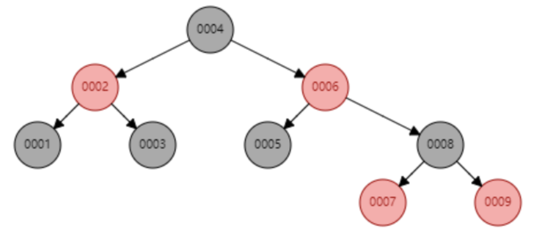
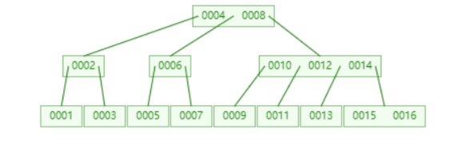
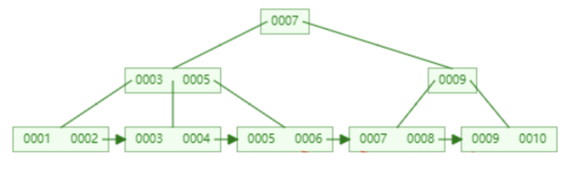

## B树和B+树索引结构

** 注： 数据库的索引加载到内存中，海量数据存储于硬盘中，因此获取数据需于硬盘进行I/O操作

* BTree和二叉树的区别：
  * 二者的每个节点都存储（key和数据），查询数据的时候从主节点依次向下
  * `平衡二叉树`每个Node只有一个关键字和两个指向孩子的指针，而 `BTree`每个InnerNode有 k-1 个关键字  和 k 个子树, BTree是多路树。
  * `BTree`的所有叶子节点都在同一层，并且叶子节点只有关键字，指向孩子的指针为 null
  * 随着数据的增长，二叉树就会变高就会导致io变多,最终会影响查询变慢，而BTree的每个节点可以表示的信息更多，因此整个树更加“矮胖”，这在从磁盘中查找数据（先读取到内存、后查找）的过程中，可以减少磁盘 IO 的次数，从而提升查找速度。二叉树（AVL树和红黑树）基本都是存储在内存中才会使用的数据结构，

二叉树：
  
BTree:
  
B+Tree：
  

* BTree和B+Tree的区别
  * `B+Tree` InnerNode 仅存储key, LeafNode 存储key和数据, 所以同样大小的Page页可以容纳更多的节点元素。（这就意味着B+会更加矮胖，**查询的IO次数会更少**）, 通常就3\~4层（3\~4次IO）
  * LeafNode 还存储其右侧 LeafNode 的指针，使得LeafNode两两相连，符合磁盘的预读特性, **顺序查询和范围查询性能更高**
  * B+Tree所有查询都要查找到叶子节点，**查询性能稳定**。
  * B+树适合范围查询和顺序访问，而B树更适合随机查询。

* 树索引对比Hash存储：
  * Hash索引时间复杂度为$O(1)$，树索引是$O(log(n))$
  * 当出现大量键重复哈希冲突，效率下降。
  * Hash无序不支持范围查询，无法用于排序分组
  * B+树的设计允许索引数据分批加载
  * 需要检索多条数据时B+的结构更有利。

## 什么是关系型数据库，与非关系型数据库有什么区别

**关系型数据库：**

是一种基于关系模型来组织数据的数据库系统。在关系型数据库中，数据结构以表格形式呈现，每个表格包含一组相关的数据元组。关系型数据库采用结构化查询语言（SQL）来管理和操作数据。关系型数据库在数据完整性和事务性方面有更强的保障。

**非关系型数据库：**

并不是采用传统的表格形式来表达数据，而是采用键值对、文档、图形或者列族等数据结构来存储数据。大多数不支持 SQL 查询，需要各自的工具来操作数据。在性能和扩展性方面有更大的优势。

## MySQL和SQLite的主要区别：

MySQL和SQLite都是关系型数据库，但它们在设计理念、应用场景和功能特性上存在显著差异。

**1. 设计理念与架构**
MySQL：客户端/服务器架构：MySQL是典型的客户端/服务器模式，数据库引擎独立运行，客户端通过网络连接访问数据库。多用户并发访问：MySQL设计之初就考虑到了多用户并发访问的需求，具有较强的并发处理能力。
SQLite：嵌入式数据库：SQLite将数据库嵌入到应用程序中，不需要独立的数据库服务器进程。单进程访问：SQLite通常只允许一个进程访问数据库，不适合高并发环境。
**2. 应用场景**
MySQL：大型应用：适用于高并发、大数据量的Web应用、企业级应用等。复杂查询：支持复杂的SQL查询和事务处理。分布式部署：可以部署在多个服务器上，实现分布式数据库。
SQLite：小型应用：适合小型桌面应用、移动应用、嵌入式系统等。数据量较小：适用于数据量较小、对性能要求不高的场景。离线应用：由于SQLite是嵌入式的，因此可以用于离线应用。
**3. 功能特性**
MySQL：功能丰富：支持丰富的SQL语句、存储过程、触发器等。高性能：通过优化器、索引等技术，提供高效的数据访问。高可用性：支持主从复制、故障转移等高可用性特性。
SQLite：轻量级：占用资源少，启动速度快。易于使用：不需要复杂的配置，易于集成到应用程序中。自包含：将数据库文件作为单个文件存储。
**4. 性能对比**
SQLite在小型数据集上的读写速度通常比MySQL快。
MySQL在处理大规模数据和高并发访问时具有更好的性能。

**总结**
选择哪个数据库取决于你的具体需求：

如果需要处理大量数据、高并发访问，并且对数据库的可靠性要求较高，那么MySQL是一个不错的选择。
如果需要一个轻量级的数据库，用于小型应用或嵌入式系统，并且对性能要求不高，那么SQLite是一个很好的选择。
总结来说，MySQL更适合大型复杂的应用，而SQLite更适合小型简单的应用。

## MySql有哪些索引类型？

**按数据结构分类:**

* B+树索引： MySQL中使用最广泛的索引类型，适用于范围查询、排序等操作。它将数据按照  B+树的结构存储，通过多次查找叶子节点来定位数据。
* 哈希索引： 基于哈希表的索引，仅适用于等值查询，不支持范围查询。查询速度非常快，但不能用于排序。

**按物理存储分类:**

* 聚簇索引： 数据本身按照索引的顺序存储，一个表只能有一个聚簇索引。通常主键索引就是聚簇索引。
* 二级索引： 非聚簇索引，索引和数据是分开的，通过索引找到行记录的地址，然后根据地址找到数据。

**按字段特性分类:**

* 主键索引： 唯一标识一条记录，不允许为空值。
* 普通索引： 允许重复值和空值，用于加速对列的查询。
* 唯一索引： 索引列的值必须唯一，但允许空值。
* 组合索引： 在多个列上创建的索引，可以提高多列查询的效率。
* 全文索引： 用于全文搜索，能够快速查找文本中的关键词。

**按索引的常规功能分类:**

* 唯一索引： 要求索引列的所有值都只能出现一次，即必须唯一。
* 普通索引： 仅用来提高查询速度，没有其他特性。
* 空间索引： 使用R树，用于索引多维数据。
* 全文索引： 用于全文搜索，能够快速查找文本中的关键词。

## MySQL有哪几个数据库引擎

* `InnoDB`特点： 事务安全（支持ACID特性）、支持外键、支持行级锁、支持MVCC（多版本并发控制）、支持崩溃恢复。适用场景： 绝大多数在线事务处理（OLTP）系统，要求高并发、高可靠性，以及需要事务支持的场景。它是MySQL 5.5版本以后的默认存储引擎。
* `MyISAM`特点： 访问速度快，占用空间小，不支持事务、不支持外键、不支持行级锁。适用场景： 适合以读操作为主，对事务完整性要求不高的应用，如数据仓库、日志系统等。
* `MEMORY（HEAP）`特点： 将数据全部存储在内存中，访问速度极快，但数据不持久化，重启数据库后数据丢失。适用场景： 用于临时表、缓存等，对数据安全性要求不高的场景。

## NoSQL的数据库类型

* **文档型数据库:**
  用于存储和管理文档，‌这些文档通常是结构化的数据，‌如JSON格式。常见的文档存储数据库有**MongoDB**
  `MongoDB`以一系列键值对集合的方式存储数据，其中键(Key)是字符串，值(Value)是动态模式,这意味着同一个集合里的文档不需要有相同的字段和结构。

* **键值存储数据库:**
  最简单的NoSQL数据库。键对值对存储数据库中的数据是以键值对的形式来存储的。当查询数据时，基于Key的哈希值实现快速查询,常见的键值对存储数据库有**Redis**
  `Redis`是一款缓存数据库，数据存储在内存中，提供了极高的读写速度，但受限于内存大小

* **列族存储数据库：**
  以列为单位存储数据，然后将列值顺序地存入数据库中，这种数据存储法不同于基于行式存储的传统关系型数据库。列式存储数据库可以高效地存储数据，也可以快速地处理批量数据实时查询数据。适合需要高效读取大量数据的场景，‌例如日志分析和数据仓库。‌

* **图形存储数据库:**
  应用图形理论来存储实体之间的关系信息，其中，实体被视为图形的“节点”，关系被视为图形的“边”，“边”按照关系将“节点”按进行连接。图数据库可以直观地可视化关系，是存储、查询、分析高度互联数据的最优办法。

