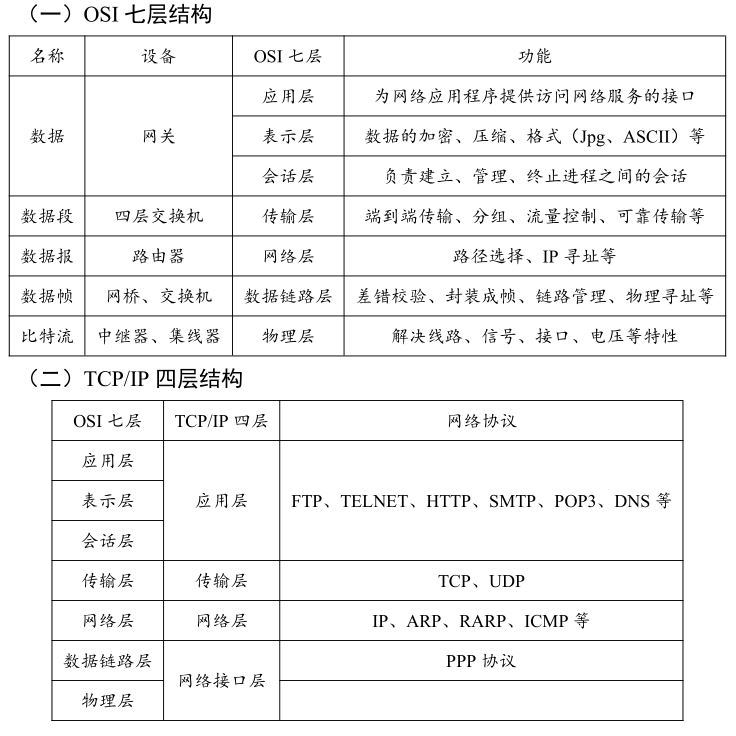
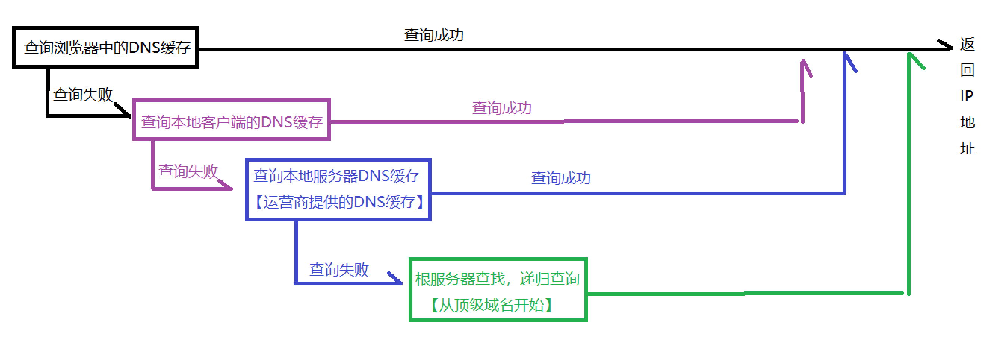
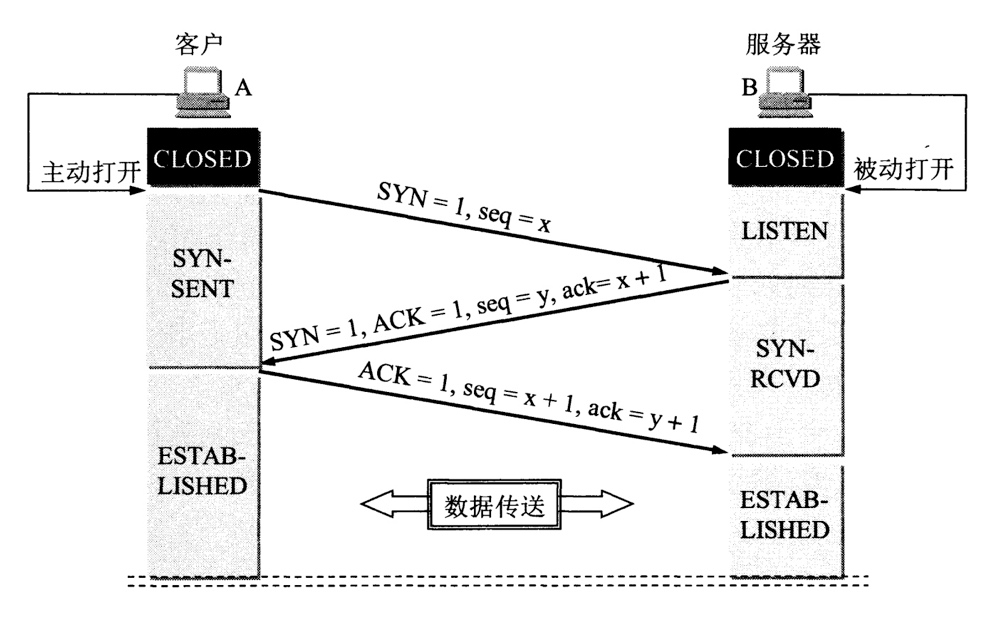
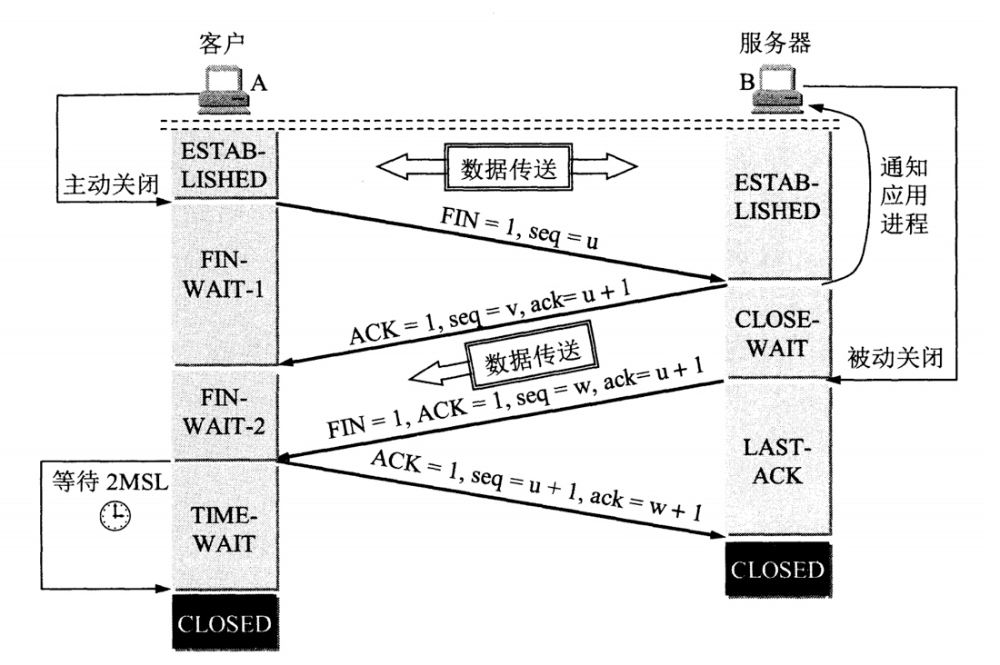
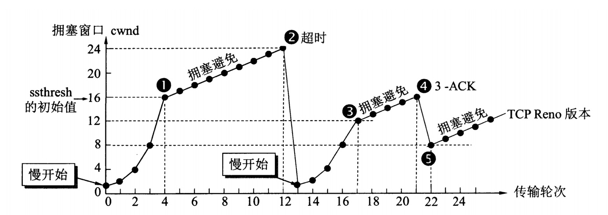

#### 1.计网的七层/四层网络模型

  

#### 2.域名系统DNS

* DNS作为可以将域名和IP地址相互映射的一个分布式数据库，能够使人更方便的访问互联网，而不用去记住能够被机器直接读取的IP数串。
* DNS的作用就是将网址解析为 IP 地址。（比如百度 www.baidu.com，其IP为$183.232.231.17$）
* DNS（‌域名系统）‌在大多数情况下使用UDP进行通信, 使得DNS查询和响应能够更快地进行, 但在DNS的某些特定任务中，‌如区域传输（‌zone transfer）‌，‌TCP也是被使用的。
* **DNS解析过程：**
  1. 当DNS服务器收到查询请求后，首先在浏览器缓存找，
  2. 接着在Hosts文件（即本地操作系统缓存）中找
  3. 迭代查询访问DNS服务器，包括有路由缓存，互联网DNS服务器，以及13台根服务器
    

如果查不到，可能是因为该服务器不是请求域的授权服务器，并且以前查询的缓存中没有需要的记录，这时DNS服务器必须向转发域名服务器（转发域名服务器负责所有非本地域名的查询）发送请求。如果没有转发域名服务器则找根域名服务器（采用迭代查询）。

#### 3. TCP的三次握手与四次挥手过程(结合CS144)

**三次握手(建立连接)**：
  

1. 客户端的Sender选取一个随机数作为ISN（即上图的seq=x），只将ISN包进TCP帧，payload=0，发给服务器的Receiver。
2. 服务器的Receiver返回一个包含着ackno=x+1以及窗口大小的确认帧，这时客户端的Sender和服务器的Receiver达成同步，都将x+1作为整个数据流的初始位置（建立第一条链接）
3. 同样的，服务器的Sender和客户端的Receiver也进行同样的操作，只不过此时服务器的Sender随机选择的是y
4. 客户端的Receiver返回一个包含着ackno=y+1以及窗口大小的确认帧，这时服务器的Sender和客户端的Receiver达成同步，都将y+1作为整个数据流的初始位置（建立第二条链接）

* **为什么是三次握手，而不是四次？**
答：在第二次握手的时候，服务器的Receiver回应的ackno=x+1，和服务器的Sender发送的seq=y可以合在一个TCP帧里发送，就节省了一次。

* **为什么需要三次握手，而不是两次？**
答：如果client不会向server的确认发出确认，当收到早已失效的报文段后会单方面认为链接已建立而等待发来的数据。

**四次挥手(断开连接)**
  

1. 当客户端Sender的流发完之后，会发送一个包含FIN的TCP帧
2. 服务器的Receiver收到后，回复一个ackno=FIN+1的帧，之后断开客户端Sender和服务器Receiver的连接
3. 同样的当服务器的Sender的流发完之后，会发送一个包含FIN的TCP帧
4. 客户端的Receiver收到后，回复一个ackno=FIN+1的帧，之后断开服务器Sender和客户端Receiver的连接

* 关闭的发起者是可以是任意一方的Sender。TCP是全双工模式，当Client Sender发出FIN=M时，只是代表告诉Server Receiver，Client Sender发送的数据流已经发完了，只是关闭了Client Sender。当Server Receiver收到FIN报文并返回ackno=M+1，表示它已经知道Client Sender没有数据发送了，也只是关闭了Server Receiver，但是Server Sender还是可以发送数据到Client Receiver的，所以并不会立即关闭SOCKET。

* Client Receiver发送完最后的ackno=N+1不能直接进入CLOSED状态，而要保持TIME_WAIT(２MSL, MSL是最长报文段寿命（Maximum Segment Lifetime）)，保证TCP协议的全双工连接能够可靠关闭。当网络原因导致了Server Sender没有收到Client Receiver的ackno=N+1，那么Server Sender就会在超时重传FIN=N，如果此时Client端的连接已经关闭处于CLOESD状态，那么重传的FIN=N就无法得到ack回应，从而导致Server Sender无法关闭。

#### 4. ARP协议(结合CS144)

* ARP 协议实际上负责 IP 地址和 MAC 地址之间的映射，这个映射关系完全由抽象的网络接口`NetworkInterface `自己学习。
* 当`NetworkInterface` 转发 IP 数据报时发现找不到下一跳 IP 地址所对应的以太网地址（查表），就会向网络中广播一个 ARP 请求，并缓存这个数据报直到 ARP 请求得到响应。
* 相对的，如果 `NetworkInterface` 收到了一个 ARP 请求，并且该请求所请求的 IP 地址和自己的对上了，就会向该请求的发送方回传一个 ARP 响应。
* 为了学习网络中 IP-以太网地址的映射关系，NetworkInterface 需要维护一张映射表。而为了适应动态变化的网络拓扑结构，这张映射表肯定需要定时强制更新；表中的每个映射关系最长只能存在一定时间。
* 为了避免频繁的 ARP 请求阻塞网络，我们需要保证一定时间内，相同的 IP 地址的 ARP 请求只发出一次。
* 抽象的网络接口`NetworkInterface `需过滤掉目的以太网地址既不是广播地址（ETHERNET_BROADCAST）、也不是本接口的以太网地址（ehternet_address_）的数据帧。
* 当数据帧的协议是 IPv4 时，且解析成功（`parse()` 返回值为 true），那么就把解析得到的 `InternetDatagram` 数据报推入队列 `datagrams_received_` 中。
* 若数据帧协议为 ARP，且解析成功，那么按照得到的 `ARPMessage` 中的信息，分析是请求本接口的 IP 地址和以太网地址的映射关系、还是响应之前本接口发出的 ARP 请求。如果是 ARP 请求，那么就组装对应的 ARPMessage 并发送给请求发送方；如果是 ARP 响应，那么就将先前缓存的、现在能发送的 IP 数据报全部发送出去。
* 无论是 ARP 请求还是 ARP 响应，只要数据帧解析成功，都要从中学习新的地址映射关系

#### 5. TCP拥塞控制

为了更好对TCP进行拥塞控制，因特网建议标准定义了以下四种算法：**慢开始，拥塞避免，快重传，快恢复**。 首先在TCP要求发送端维护两个窗口：

* 接收窗口 rwnd: 接收方根据当前缓存大小所许诺的最新窗口值.
* 拥塞窗口 cwnd: 发送方根据自己估算的网络拥塞程度而设置的窗口值。(congestion window)

**发送窗口的上限是取这两者(接收窗口、拥塞窗口)的最小值。**

**发送方如何知道网络发生了拥塞？**

答：当网络发生拥塞时，路由器就要丢弃分组，只要当发送方没有收到按时到达的确认报文，就可以猜想网络出现了拥塞

  

* `慢开始`： TCP刚连接好时，先令拥塞窗口cwnd =1 ,在每次收到一个对新报文段的确认时将cwnd加倍(因此是成倍增长2的n次方)。cwnd的大小呈指数增长。

* `拥塞避免算法`： 当cwnd大于等于慢开始门限ssthresh时，cwnd窗口每次加 1 而不是加倍，这是因为线性规律增长，使网络不容易出现拥塞。当发送方检测到**超时事件**的发生时，**就将慢开始门限ssthresh设置为当前cwnd的一半，同时将cwnd重新设置为1**. 这样的目的是迅速减少主机发送到网络的分组数，使得发生拥塞的路由器有足够的时间把队列中积压的分组处理完毕。**然后继续执行慢启动—拥塞避免**

* `快重传`：接收方每收到一个失序的报文段后就立即发出重复确认，而不是等待自己发送数据时才捎带确认，（为的是使发送方及早知道有报文段没有到达对方）**当发送方连续收到三个重复的ACK报文时**，就立即进行重传。直接重传对方尚未收到的报文段，而不必等待那个报文段设置的重传计时器超时。**然后执行快恢复算法**

* `快恢复`：当发送端收到连续三个重复的ACK和执行快重传后，发送端调整门限值 cwnd = ssthresh = cwnd / 2, 即发送端口、阈值都等于当前窗口的一半。然后执行拥塞避免算法。

因为收到失序的报文是网络的正常丢包，不能认为是网络发生拥塞（如果发生了拥塞，就不会有连续几个报文段连续到达接收方，使发送方连续收到三个确认了），所以这个时候不是执行慢开始算法，而是把 cwnd 值设置为门限 ssthresh 的一半，然后执行拥塞避免算法。

#### 6. TCP的可靠性如何保证

在TCP的连接中，数据流必须以正确的顺序送达对方。TCP的可靠性是通过确认机制来保证安全的到达，即采用**顺序编号**、**确认（ACK）**、**超时重传**等来实现的。TCP在开始传送一个段时，为准备重传而首先将该段插入到发送队列之中，同时启动时钟。其后，如果收到了接受端对该段的ACK信息，就将该段从队列中删去。如果在时钟规定的时间内，ACK未返回，那么就从发送队列中再次送出这个段。TCP在协议中就对数据可靠传输做了保障，握手与断开都需要通讯双方确认，数据传输也需要双方确认成功，在协议中还规定了：分包、重组、重传等规则；而UDP主要是面向不可靠连接的，不能保证数据正确到达目的地。

#### 7. TCP与UDP的区别

* TCP**面向连接**的，**可靠的**数据传输服务；UDP面向**无连接**的，尽最大努力的数据传输服务，**不保证数据传输的可靠性**
* TCP**面向字节流**，UDP**面向报文**

  * 应用进程交给 UDP 多长的报文， UDP 就照样发送，**一次发送一个报文**
  * TCP 在发送时采取的方式完全不同：TCP 根据对方给出的窗口值和当前网络拥塞的程度来决定一个**报文段**应该包含多少个字节。如果报文太长，TCP会将其拆分再发送，如果报文太短，TCP会等待积累足够多的字节后再构成报文段发送出去
* TCP与UDP的适用场景
  * TCP数据传输慢, 适用于效率要求相对低，但对准确性要求相对高的场景。因为传输中需要对数据确认、重发、排序等操作，相比之下效率没有UDP高。TCP 适用于电子邮件（SMTP）、远程终端接入（TELNET）、万维网（HTTP）、文件传送（FTP）
  * UDP 适用于效率要求相对高，对准确性要求相对低的场景。如视频直播、QQ语音电话等即时通讯、广播通信。开销小（因为提供可靠的、面向连接的运输服务，会多很多开销比如确认、流量控制、计时器、连接管理等），也适用于简单文件传送（TFTP）、路由选择协议（RIP）、域名系统（DNS）等
* TCP有**拥塞控制**，UDP没有拥塞控制，因此网络出现拥塞不会使源主机的发送速率降低（对实时应用很有效，如直播，实时视频会议等）
* TCP 只能是**一对一的通信**（TCP连接的端点是**套接字socket**），而 UDP 支持一对一、一对多、多对一和多对多的通信
* TCP 的**首部开销大**，有 20 个字节，比 UDP 的 8 个字节的首部要长; 
* **UDP数据包**的大小为$2^{16}-1-20-8$, **分片**发送的UDP数据的最大长度为（MTU-20(IP头部大小)-8（UDP头部大小）），  **TCP**数据的最大长度为（MTU-20(IP头部大小)-20（TCP头部大小）），**MTU**为数据链路层的最大传输单元，一般为1500或1492，也可自己设置。
* TCP提供可靠**全双功**的通信服务, TCP 允许通信双方的应用进程在任何时候都能发送数据。TCP **连接的两端都设有发送缓存和接收缓存**，用来临时存放双方通信的数据；UDP是**半双功，只能单向传播**。
* TCP与UDP的区别很大一部分来自于**流控制**, TCP面向字节流中的“流”（Stream）指的是流入进程或从进程流出的字节序列。“面向字节流”的含义是：虽然应用程序和 TCP 的交互是一次一个数据块（大小不等），但 **TCP 把应用程序交下来的数据仅仅看成是一连串的无结构的字节流。**

#### 8. HTTP协议与HTTPS协议的区别

* HTTP：超文本传输协议。HTTPS：安全套接字层超文本传输协议(HTTP+SSL)

    注： SSL (Secure Sockets Layer 安全套接层)，及其继任者传输层安全（Transport Layer Security，TLS）是为网络通信提供安全及数据完整性的一种安全协议。TLS 与 SSL 在传输层与应用层之间对网络连接进行加密

* HTTP 的URL 以http:// 开头，而HTTPS 的URL 以https:// 开头

* HTTP 是不安全的，而 HTTPS 是安全的（没有绝对的安全，只有相对的安全）

* HTTP：无法加密（客户端和服务器端传递的是明文的消息）。HTTPS：对传输的数据进行加密（将明文进行加密后再在客户端和服务器之前进行传递）

  * HTTPS 采用非对称加密和对称加密两种加密方式来保证传输信息的安全性：

    * 非对称加密：用公钥和私钥来加解密。
    * 对称加密：加密解密都用同一套秘钥

* 在OSI 网络模型中，**HTTP工作于应用层**，而 **HTTPS 的安全传输机制工作在传输层**

* HTTP采用**80端口**，而HTTPS采用**443端口**

* HTTPS需要**申请证书**

**HTTPS 优点：**

* HTTPS 传输数据过程中使用密钥进行加密，所以安全性更高；
* HTTPS 协议可以认证用户和服务器，确保数据发送到正确的用户和服务器；

**HTTPS 缺点：**

* HTTPS 握手阶段延时较高：由于在进行 HTTP 会话之前还需要进行 SSL 握手，因此 HTTPS 协议握手阶段延时增加；
* HTTPS 部署成本高：一方面 HTTPS 协议需要使用证书来验证自身的安全性，所以需要购买 CA 证书；另一方面由于采用 HTTPS 协议需要进行加解密的计算，占用 CPU 资源较多，需要的服务器配置更高。

#### 9. 什么是SSH？如何使用SSH连接到远程服务器？

SSH（‌Secure Shell）‌是一种加密的网络传输协议，‌用于在远程计算机上建立安全的Shell会话。‌它通过加密和认证机制实现安全的访问和文件传输等业务，‌提供了一种对远程用户进行身份验证、‌将输入从客户端传输到主机以及将输出中继回客户端的机制。‌SSH由服务器和客户端组成，‌为建立安全的SSH通道，‌双方需要先建立TCP连接，‌然后协商使用的版本号和各类算法，‌并生成相同的会话密钥用于后续的对称加密。‌在完成用户认证后，‌双方即可建立会话进行数据交互。‌

使用SSH连接到远程服务器涉及以下几个步骤：‌

1. 获取远程服务器的IP地址：‌这是互联网协议地址，‌用于在浏览器中输入以访问云服务器。‌
2. 生成SSH密钥对：‌包括公钥和私钥。‌公钥用于加密通信，‌私钥用于身份认证。‌
3. 安装SSH客户端：‌运行在本地计算机上的软件，‌如PuTTY、‌OpenSSH等，‌用于连接到远程云服务器。‌
4. 运行SSH命令：‌在终端或命令提示符中输入SSH命令，‌指定远程服务器的IP地址和用户名，‌开始连接过程。‌
5. 身份验证：‌使用SSH密钥对进行身份验证，‌确保连接的安全性。‌

一旦连接成功，‌用户就可以通过SSH会话远程访问和控制服务器，‌进行文件传输、‌命令执行等操作。‌SSH协议的出现，‌作为Telnet和其他不安全远程shell协议的安全替代方案，‌解决了传统远程登录和文件传输方式存在的安全隐患，‌提供了安全的网络服务