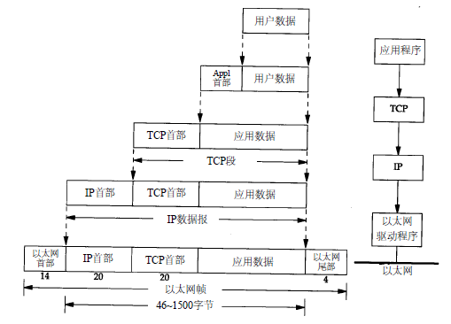

## Check0 Byte Stream

### HTTP是怎么完成通信的(webget\.cc)

**HTTP通信建立在TCP连接之上**，这意味着在通信之前，客户端和服务器需要先通过TCP进行“握手”，建立一个全双工的通信连接。

```C++
'''
host: 需要连接的服务端的名字(网址)，如“cs144.keithw.org”
path: 告诉需要访问的服务器URL的路径部分。如“/hello”
'''
void get_URL( const string& host, const string& path )
{
  CS144TCPSocket tcp; // 在客户端创建TCPSocket

  Address address( host, "http" ); // 通过需要解析的主机名和采用的服务（此处用HTTP，端口 80）来获得需要连接的地址(DNS解析获得的IP地址)
  tcp.connect( address ); // 将Socket连接到指定的对等地址

  // 以下为http协议的规范部分 // 
  string line1 = "GET " + path + " HTTP/1.1" + "\r\n"; // 告诉所需的服务器 URL 的路径部分。
  string line2 = "Host: " + host + "\r\n";             // 告诉服务器 URL 的主机部分
  string line3 = "Connection: close\r\n"; // 告诉服务器客户端会在服务器发送响应后关闭连接。
  string line4 = "\r\n"; // 再按一次 Enter 键。这会发送一个空行并告诉服务器您已完成您的 HTTP 请求。
  tcp.write( line1 + line2 + line3 + line4 );

  // 打印服务器的所有输出，直到套接字到达“EOF”
  string buffer;
  while ( !tcp.eof() ) {
    string part;
    tcp.read( part );
    buffer += part;
  }
  cout << buffer;
  tcp.wait_until_closed(); // 关闭套接字，并等待 TCPPeer(对等方) 完成
}
```

1. 先在客户端建立一个TCPSocket
2. 通过hostname 和 servierName（决定端口） DNS解析获得的IP地址，并进行TCP连接
3. Socket接口，通过端口按照协议规范进行通信。
4. 输出收到得响应信息。

### 内存中可靠的字节流（byte_steam.cc）

实现一个**固定容量的单线程消息队列**。当是写入者时可以将一些数据推送到队列中(**接受并写入对等方发送来的数据**)，是读取者时可以读取队列内的数据并弹出一些数据(**供所需的应用程序读取)**。用于**应用层**应用软件和**传输层**TCP的交互。

```C++
// 简单的通过deque或其他数据结构便能实现。
```

[消息队列的缺点-复制](%E6%93%8D%E4%BD%9C%E7%B3%BB%E7%BB%9F.md#DisadvantagesOfMessageQueuing)

## Check1 Reassembler

### 按顺序拼装字节流(reassembler\.cc)

TCPSender将其要发送的字节流分成小段（每个子串不超过**1460字节**）。但是网络可能会**重新排列**这些数据报，或者**丢弃**它们，或者**多次传递**它们。因此Receiver须将这些数据报重新组装成一个连续字节流，通过在内部的Reassember中维护一个缓存`_buf`来将**适合字节流`byte_steam`可用容量但还不能写入（因为早期的字节仍然未知）的字节存储起来**。

Reassembler自身内部缓存`_buf`的大小不得大于内存中`byte_steam`的剩余可用容量

Reassembler每次接收到的**子字符串**包含以下信息：

* `first_index`: 子字符串第一个字节的索引
* `data`: 子字符串自身，即数据
* `is_last_substring`: 指示该子字符串是否是流的结尾

**具体实现：**

* 每次收到一个子字符串信息，**判断是否是最后一个子字符串，若是则保存下来**用于最后的检查
* 如果**当前子串的索引小于_next_need_index** 即旧数据，则**跳过**它
* 如果**当前索引超出容量范围**，即太后面的数据，也**跳过**它
* 计算出该新子串数据的有效区间和有效数据（**start_index, end_index, data）**去掉重叠, 利用二分查找在_buf内找到区间有交集的数据并合并
* 将符合要求的顺序数据写入字节流`byte_stream`
* 检查所有字节是否已写入输出流，若是则关闭字节流`byte_stream`的写入端

## Check2 TCP Receiver

### 在64位索引和32位序列号之间转换(wrapping_integers.cc)

在**TCP中**，空间宝贵，**流中每个字节的索引**不是用64位索引表示的（在`Reassembler`中使用），而是**用32位的序列号“seqno”表示**的

**流中的第一个字节的序列号随机的（不是0）**，称为**初始序列号ISN**也叫**zero_point**。原因是：为了提高**鲁棒性**并避免被属于同一端点之间早期连接的**旧段混淆**

$\therefore$ 需将**64位转换为32位（减去ISN求余**）和**32位转换为64位(取离checkpoint最近的)**

在TCP中，**SYN**（流的开始）和**FIN**（流的结束）控制标志**也会被分配序列号**。（**SYN标志占用的序列号是ISN**）**但SYN和FIN不是流本身的一部分，也不是“字节”**——它们表示字节流本身的开始和结束。

### 实现TCP接收器(tcp_receiver.cc)

TCPReceiver**接收**来自对等方发送方的消息`TCPSenderMessage`（通过`receive()`方法）:

```C++
struct TCPSenderMessage
{
  Wrap32 seqno { 0 }; // 段开头的序列号(seqno)。如果设置了SYN标志，则这是SYN 标志的序列号。否则，它是有效负载开头的序列号
  bool SYN { false }; // SYN 标志
  std::string payload {}; // 有效负载：字节流的一个子串
  bool FIN { false }; // FIN标志
  bool RST { false }; // 复位标志。如果设置，则流已发生错误，并且应中止连接
};
```

并对消息调用`Reassembler`**重新组装**程序以写入`ByteStream`**字节流**。应用程序从这个字节流中读取数据。

同时，TCPReceiver还通过`send()`方法向对等发送方**发送**`TCPReceiverMessage`消息。这些消息负责告诉对等方的TCPSender：

  ```C++
    struct TCPReceiverMessage
    {
    std::optional<Wrap32> ackno {}; // TCP 接收方所需的“下一个”序列号
    uint16_t window_size {}; // ByteStream中的可用容量。窗口大小
    bool RST {}; // （复位）标志。如果设置，则流已发生错误，并且应中止连接。
    };
  ```

使用该窗口，接收方可以控制传入数据的流量，**使发送方限制发送量**，直到接收方准备好接收更多数据。我们有时将**ackno称为窗口的“左边界”（最小索引）**，将**ackno+窗口大小称为“右边界”（最大索引+1）**。

## Check3 TCP Sender

TCPSender部分，负责**读取ByteStream**（由某个发送方应用程序创建并写入），并**将流转换为段的序列**，然后用不可靠数据报包装起来，**发送**`TCPSenderMessage`给对等方的TCPReciever.(通过push()方法):

* **判断是否还能**发送新的数据（比较已发送但未完成的数据长度与窗口大小），若能则一直发送（While）
* 查看**是否**已**发送SYN**标志, 没有则这次的`TCPSenderMessage`中需发送
* 获得**最大的有效负载**的最大长度`payload_len = min(TCPConfig::MAX_PAYLOAD_SIZE, _window_size - _outstanding_sequence_numbers, byte_steam.bytes_buffered());`
* 从**ByteStream中读取**对应长度的数据，如果读完reader中的所有字节，检查**是否已发送FIN**并且是否可以发送
* 发送`TCPSenderMessage`并添加到`_outstanding_segments_collection`中, 并**启动计时器**如果尚未启动。

TCPSender在`_outstanding_segments_collection`中跟踪哪些**分段已发送但尚未被接收方确认**

当TCPSender收到对等方的TCPReciever发来的`TCPReceiverMessage`后(recieve())：

* 根据该消息中的**窗口大小信息**调节，若收到的窗口大小为0，则设为1（默认开始时也是1），防止一直不发。
* 再检查收到的**ACK信息**，如果没有确认新数据，则忽略，这样就不会重置计时器。如果不可能确认（超出下一个要发送的序列号，来自旧段），也忽略。
* 否则则根据新的确认号**删除**未完成集合`_outstanding_segments_collection`中所有**已完成的数据**，并**重置RTO 回其“初始值”**，**重置“连续重传”计数为零**。如果未完成集合仍有任何未完成的数据，则**重新启动重传计时器**。

计时器通过tick()方法流逝，如果调用了tick并且**重传定时器已过期**：

* 需要**重新传输**尚未完全确认`_outstanding_segments_collection`中**最早（最低序列号）的段**
* 如果接受到的Reciever方**窗口大小非零**：将**RTO值翻倍**（**指数退避**，为了不加重网络的拥塞），并记录增**加一次连续重传次数**
* **重启计时器**。

## Check5  network interface

    

**网络接口**将负责在TCP/IP下层**生成**原始**以太网帧**，网络接口**查找（并缓存）**下一跳**IP地址的以太网地址**，网络接口使用**ARP协议**将下一跳路由器的**IP地址**转换成**硬件(MAC)地址**，并将此硬件地址放在链路层帧的首部，然后根据这个硬件地址找到下一跳路由器。

当路由器或TCPConnection 想要将一个IP数据报**发送**给下一跳（next_hop）时，调用网络接口的send_datagram()方法：

* 如果**目标以太网地址已知**，则**创建一个以太网帧并立即发送**
* 否则，将 **IP 数据报存储排队**`datagrams_queue_`，以便在收到 ARP 回复后可以发送它。
* 检查该IP地址**是否有发送ARP请求以及是否失效**（5s），**防止ARP请求淹没网络**。
* 若需要发送，则**生成APR请求**并**打包成以太网帧**，**广播**该 ARP 请求以获取下一跳的以太网地址

当网络接口收到**传入**的以太网帧时recv_frame()：

* **忽略目标地址不是该网络接口**的信息
* 如果收到的是包含**ip数据报的以太帧**，**接受**并解析, **等待路由的下一次转发**。
* 如果收到的是包含**ARP的以太帧**，解析并**检查**其中的ARP信息的**目标IP**是否是我们，不是则忽略。
* 否则，**记住发送者的IP地址和以太网地址之间的**映射**关系**一定时间**(30s)，无论是ARP请求还是ARP回复。
* **发送**`datagram_queue`中 key = ARP_dgram.sender_ip_address 的所有**等待消息**
* 如果这是一个 **ARP 请求**，要求我们提供 IP 地址，则**发送适当的 ARP 回复*。

时间流逝通过tick()方法，当调用tick时：

* 对于所有**IP映射**，**改变时间并删除所有死映射**
* 对于所有的**发送的ARP请求，改变时间并删除所有失效的请求**

## Check6 IP router

网络接口负责根据ARP协议解析下一跳ip地址对应的的以太网地址（MAC物理地址）。然而ip数据报报头中并没有“下一跳ip”这个数据，它只包含**源和目的的ip地址**，这就需要**路由器来根据路由表的最大前缀匹配得到下一跳ip地址和发送的网络接口号**。得到下一跳ip对应的物理地址后，路由器将包含着ip数据报的以太网帧通过该网络接口转发到下一个目标设备。网络层的路由器通过`NetworkInterface`的抽象接口与数据链路层交互。

**路由表包含的信息：（前缀长度，IP地址前缀，下一跳IP地址，发送数据报的接口索引）**

路由器每次调用route()方法：

* **遍历**该路由的**所有接口**并处理存储在每个网络接口**缓冲队列中的所有IP数据报**
* **减少数据报的 TTL**（生存时间）。如果 **TTL 已经为零**，或者在递减后达到零，则路由器应该**丢弃**这些数据报。
* 减少TTL后需**重置校验和**（checkSum）
* 搜索路由表找到**最大前缀匹配**，根据找到的信息在对应的**接口**上**发送**修改后的数据报到对应的**下一跳**
