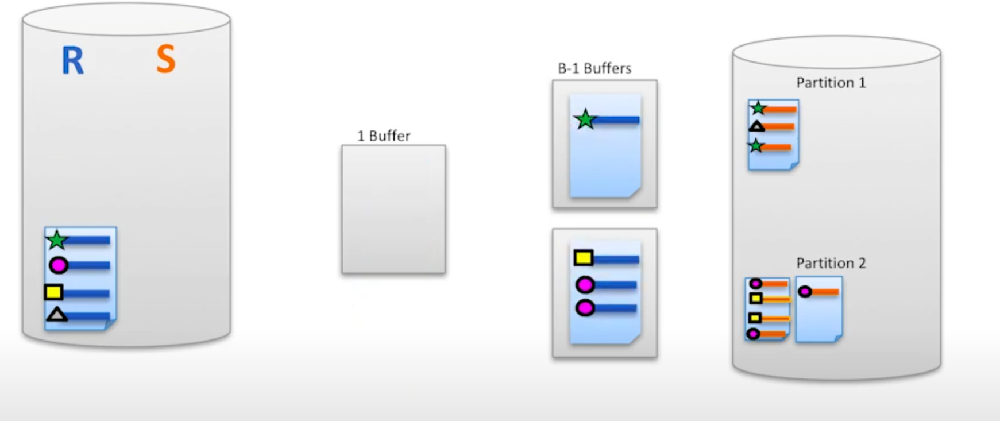
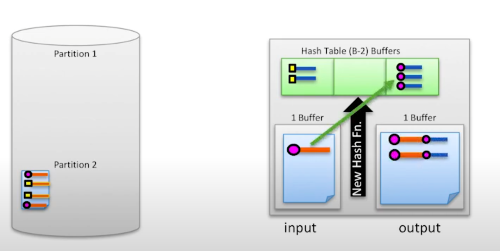
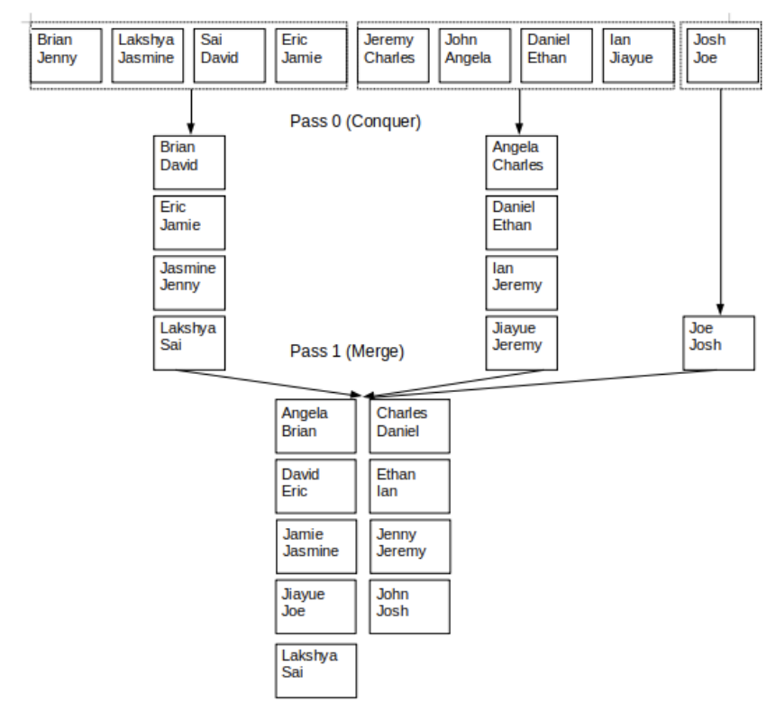

## Project 2: B+ Trees

建立索引，用于查询, 很好的一个多态例子。

`BPlusTrees.get(key)`:

                                    innerNode
                                    +----+----+----+----+
                                    | 10 | 20 |    |    |
                                    +----+----+----+----+
                                   /     |     \
                              ____/      |      \____
                             /           |           \
        +----+----+----+----+  +----+----+----+----+  +----+----+----+----+
        |  1 |  2 |  3 |    |->| 11 | 12 | 13 |    |->| 21 | 22 | 23 |    |
        +----+----+----+----+  +----+----+----+----+  +----+----+----+----+
        leafNode0                  leafNode1                  leafNode2
     
      inner.get(x) should return
     
        - leaf0 when x < 10,
        - leaf1 when 10 <= x < 20, and
        - leaf2 when x >= 20.

* 从root开始递归调用get():
  * 如果是（`InnerNode`），比较key和该InnerNode的keysArrList, 找到对应的child，递归child.get(key)。
  * 如果是`LeafNode`，则返回它本身。
* 然后用最终返回的leaf.getKey(key)获得与该“key”关联的Record ID。

`BPlusTrees.put(key，rid)`:

* 从root开始递归put():
  * 如果是`LeafNode`：
    * 检查是否已包含该key
    * 添加(key，rid)对，检查是否溢出（currSize > maxFillSize, maxFillSize = (int) 2\*d\*fillFactor）
    * 若溢出, 找到分离的`split key`, 将该`LeafNode`分裂为两个，记录新的`new_leafNode`, 返回（split_key, new_leafNode）供上一级使用
  * 如果是`InnerNode`:
    * 根据key找到对饮的childNode, 递归调用childNode.put()
    * 根据childNode返回值判断childNode是否溢出分裂。
    * 若childNode溢出分裂，添加送上来的`split_key`和`new_child_node`信息
    * 检查自身是否溢出，(currSize > 2\* d), 无需再成填充因子`fillFactor`
    * 若溢出，同样的找到分离的`split key`, 将该自身分裂为两个，记录新的`new_Node`, 返回（split_key, new_Node）供上一级使用。不同在于此时`InnerNode`中不保存`split_key`。
* 根据递归返回的信息，判断root是否溢出分裂，若分裂则要创建一个新的root。

`BPlusTrees.remove(key)`:

* 本项目删除实现无需重新平衡树，因此简单递归到leafNode查看是否含有该key，然后删除相关即可。

## Project 3: Joins and Query Optimization

### Part 1: Join Algorithms

给左表R和右表S, 找到符合条件的Record.

#### Nested Loop Joins

**simple nested loop join (SNLJ)**. 可以视为两个嵌套的 for 循环：

```python
for each record ri in R:
    for each record rj in S:
        if match(ri, rj):
            output(ri, rj)
```

缺点：需要大量 disk I/Os 操作

**Block Nested Loop Join (BNLJ)**：

Buffer大小为B, 每次从R中读取B-2 pages, 从S中读取1pages, 剩余1pages的内存用于输出。

```python
for each block of B-2 pages Br in R:
    for each page ps in S:
        for each record ri in Br:
            for each record rj in ps:
                if match(ri, rj):
                    yield(ri, rj)
```

显著减少 disk I/Os 操作

#### Hash Joins

Buffer大小为B

step1: divide to **partition**(分区)
  

* 每次从disk的R或S中读取1 page, 利用hash function $h_p$ 分区到剩下的B-1个分区。每个分区的page满了则输出到disk中。注：输出的page都只含R中record或S中record，同一分区的pages在disk中的存储邻近。

* 对于每个分区，统计来自R表和S表的各自pages数，若二者都$\geq$ B-2, 则说明该分区暂时无法在Buffer内建立内存内哈希表（B-2 Hash Table），对该分区使用另一哈希函数$h_p^{'}$重复step1。

step2: build RAM based hash table and conqure

  

* 对于每一个分区，利用B-2空间构建内存内的哈希表，将合适一侧表的数据先读入构建哈希表，对于剩余的另一侧表的数据，每次读入1page，依次在哈希表中查询配对的数据，输入到output中，output满了就输出。


#### Sort Merge Join

Buffer大小为B
  


step1: External Sort

* pass0: 每次读取B pages，用build-in的排序算法进行排序，输出为一个 sorted run。
* pass1~n: 每次读取B-1个 sorted run的 pages，将最小的数据放到output的page上，当output满了则输出，若某个sorted run 的现在的page读完了，则继续导入它的下一page。每次pass都会将sorted run 的数目 / (B-1) 直到最后只剩唯一的sorted run.

step2: Sort Merge Join

* 现在有了左表和右表的各自的sorte run，利用双指针法即可找到配对的record。

### Part 2: Query Optimization

```SQL
SELECT * FROM t1 JOIN t2 ON .. JOIN t3 ON .. 
```

然后它扫描t1 ，然后连接t2 ，然后连接t3 。在许多情况下，这会表现得很差，因此您的任务是实现动态编程算法，以更好的顺序将表连接在一起。

* pass 1: 对于每个表，找到单独访问该表的最低估计成本计划
* pass i>2: 递归的使用上一次传递的结果来查找剩余每个表的成本最低的联接。重复上述步骤，直到所有表都已联接。
* 返回最后结果里成本最低的组合方案。


## Project 4: Concurrency

涉及的锁类型：
`S(A)` 可以读取A和A的所有后代。

`X(A)` 可以读写 A 以及 A 的所有后代。

`IS(A)` 对 A 的所有子级可以请求IS或S锁

`IX(A)` 对 A 的所有子级可以请求任何锁。

`SIX(A)` S锁权限+IX锁权限

涉及锁的关系：
`compatible(A, B)` 检查锁类型A是否与锁类型B兼容, 即在同一个资源上，是否可以一个事务持有A锁，一个事务持有B锁
`canBeParentLock(A, B)` 判断如果在一个资源上拥有A锁，是否允许在该资源的子级上拥有B锁。
`substitutable(A, B)`检查A锁是否可以代替B锁，用于锁的升级。

....

实现 严格 2PL:

* 事务根据读写需求获得对应的资源的锁。
* 只有当事务完成后才会在cleanup方法中释放锁（从下而上的释放锁）


## Project 5: Recovery

采用Steal, No-Force的政策。

### Forward Processing 正向处理

当数据库正常运行时恢复管理器的工作是维护日志，添加日志记录并确保在必要时刷新日志到磁盘以确保持久性，以便我们可以从数据库中恢复随时崩溃:

  

* 每个**写操作**(SQL**插入**/**删除**/**更新**)都会获得自己的日志记录。
* 记录事务 **(transaction)** 状态的更改`commit`, `abort`和 `end`
  * COMMIT:表示事务正在开始提交过程
  * ABORT:表示事务正在开始中止过程
  * END:表示事务已完成(表示事务已完成提交或中止)

* 定期执行**模糊检查点（checkPoint）**，以最大程度地减少崩溃后的恢复时间。

### Restart Recovery 重启恢复

涉及三个阶段：`Analysis`、`Redo`和`Undo`:

* **分析阶段：** 分析阶段的全部目的是重建 **Xact表(事务表)** 和 **DPT(脏页表)** 在崩溃时的样子。
* **重做阶段：** 从 DPT 中最小的 recLSN 开始重复历史记录以重建崩溃时的状态。
* **撤消阶段：** 从日志末尾开始，一直到日志开头, 撤销需要撤销的记录。